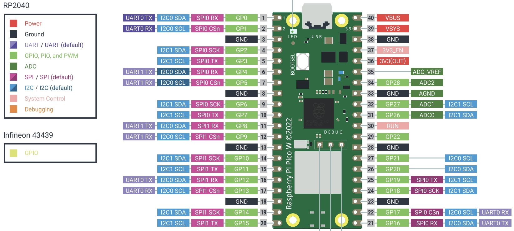

# Raspberry Pi Pico W

*Material for a [UC Irvine](https://uci.edu/) course offered by the [Department of Physics Astronomy](https://www.physics.uci.edu/) and developed by [David Kirkby](https://faculty.sites.uci.edu/dkirkby/).*

The Pico-W is a small, low cost ($6) microcontroller board designed by the Raspberry Pi foundation based on a powerful and low-cost chip, the RP2040. It also contains a 2.4 GHz module for wifi communications (and there is an even cheaper Pico
without this wifi module).

Useful links:
 - Pico Board
   - [Getting started with the Pico W](https://projects.raspberrypi.org/en/projects/get-started-pico-w)
   - [Datasheet](https://datasheets.raspberrypi.com/picow/pico-w-datasheet.pdf)
 - CircuitPython for the Pico W
   - [Getting started](https://learn.adafruit.com/getting-started-with-raspberry-pi-pico-circuitpython)
   - [Downloads](https://circuitpython.org/board/raspberry_pi_pico_w/)
 - RP2040
   - [Official documentation](https://www.raspberrypi.com/documentation/microcontrollers/rp2040.html)
   - [Datasheet](https://datasheets.raspberrypi.com/rp2040/rp2040-datasheet.pdf) (654 pages!)

Since the silkscreen labels for each pin are on the bottom side of the board, the following diagram is very helpful (download a PDF [here](https://datasheets.raspberrypi.com/picow/PicoW-A4-Pinout.pdf)):



The Pico includes advanced programmable input/output (PIO) hardware that allows any of the general-purpose (GP) pins to used for hardware-level PWM or communications protocols.  For example, to use `GP14` for PWM at 1kHz, use:
```python
import board
import pwmio

pwm = pwmio.PWMOut(board.GP14, frequency=1000)
```
Similarly, to use `GP0` and `GP1` to run an I2C bus, use:
```python
import board
import busio

i2c = busio.I2C(sda=board.GP0, scl=board.GP1)
```
