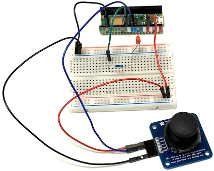
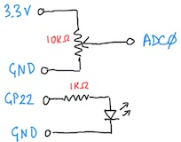

# Analog Outputs

*Material for a [UC Irvine](https://uci.edu/) course offered by the [Department of Physics Astronomy](https://www.physics.uci.edu/) and developed by [David Kirkby](https://faculty.sites.uci.edu/dkirkby/).*

In this activity you will learn about the pulse-width modulation (PWM) technique for outputting a pseudo-analog voltage from your microcontroller.

Build the circuit below using a Pico W microcontroller (not yet connected to your laptop via USB), a 1KΩ resistor, a red or green LED (your choice), the joystick, your breadboard and some jumper wires:



The corresponding circuit diagram is:



Note that this really two separate circuits connected to the microcontroller: one that reads the Xout analog state of the joystick via **ADC0**, and the other that drives an LED via **GP22**.  However, we can use a program to connect these circuits in different ways, for example:
```python
import time
import board
import analogio
import digitalio

Xout = analogio.AnalogIn(board.A0)
LED = digitalio.DigitalInOut(board.GP22)
LED.direction = digitalio.Direction.OUTPUT

while True:
    value = Xout.value
    print('Xout =',hex(value))
    if value < 0x4000 or value > 0xa000:
        LED.value = True
    else:
        LED.value = False
    time.sleep(0.2)
```
What do you expect this program to do?  Try it.

The code above connects the joystick analog input to a digital output.  Now we will connect it instead to a pseudo-analog output using a technique called pulse-width modulation (PWM):
```python
import time
import board
import analogio
#import digitalio
import pwmio

Xout = analogio.AnalogIn(board.A0)
#LED = digitalio.DigitalInOut(board.GP22)
#LED.direction = digitalio.Direction.OUTPUT
PWM = pwmio.PWMOut(board.GP22, frequency=1)

while True:
    value = Xout.value
    print('Xout =',hex(value))
    #if value < 0x4000 or value > 0xa000:
    #    LED.value = True
    #else:
    #    LED.value = False
    PWM.duty_cycle = value
    time.sleep(0.2)
```
This code keeps the original digital output in comments so you can compare with the new analog output.  What happens now when you move the joystick?

Any **GPn** pin on the Pico W can be used for PWM output like this. The necessary initialization is:
```python
PWM = pwmio.PWMOut(board.GP22, frequency=1)
```
to specify which pin you are using and a base frequency in Hertz.  Normally we will use much higher frequencies, but we start with a low frequency of 1 Hertz so we can see the analog variation in the LED flashing, which is controlled by:
```python
PWM.duty_cycle = value
```
A duty cycle is normally in the range 0-1 (or 0-100%) but we generally avoid floating-point value in microcontroller code so instead values are specified in the range 0x0000-0xffff, i.e. with an unsigned 16-bit integer.  Conveniently, the ADC `Xout.value` uses the same range, which simplifies our code.

Change the PWM frequency to 10Hz and 100Hz and describe what happens.

For a deeper dive into pulse-width modulation, visit this [interactive visualization](https://observablehq.com/embed/@dkirkby/pwm@450?cells=intro%2CpwmPlot%2Cviewof+dutyCycle%2Cviewof+pwmFreq%2Cviewof+filterR%2Cviewof+filterC%2Cfooter) to answer these questions:
 - Why do we call this a "pseudo" analog output technique?
 - Try different values of R and C for filtering the PWM output. What is the general rule for smoother output?
 - For fixed R and C values, does the smoothness of the output depend on the PWM frequency?  If so, how?
 - For fixed R and C values, does the smoothness of the output depend on the duty cycle?  If so, how?
 - For fixed R and C values, does the smoothness of the output depend on the supply voltage Vcc?  If so, how?

Now that you have seen an example of analog output, you are ready for a closer look at how analog input works (since it internally relies on analog output) using this [interactive visualization](https://observablehq.com/embed/@dkirkby/adc?cells=intro%2Cviewof+nbits%2Cviewof+theBit%2Cdiagram%2Cviewof+Vin%2Cviewof+Vcc%2Cplot%2Cfooter).
