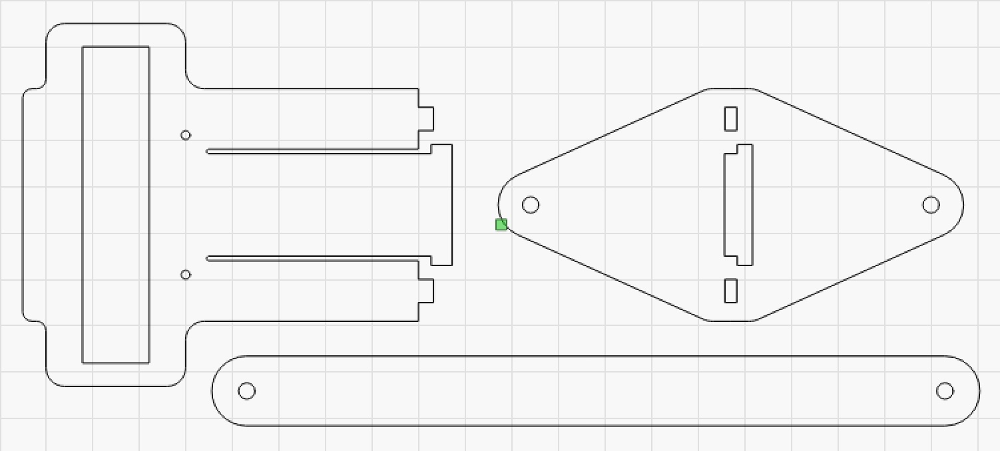
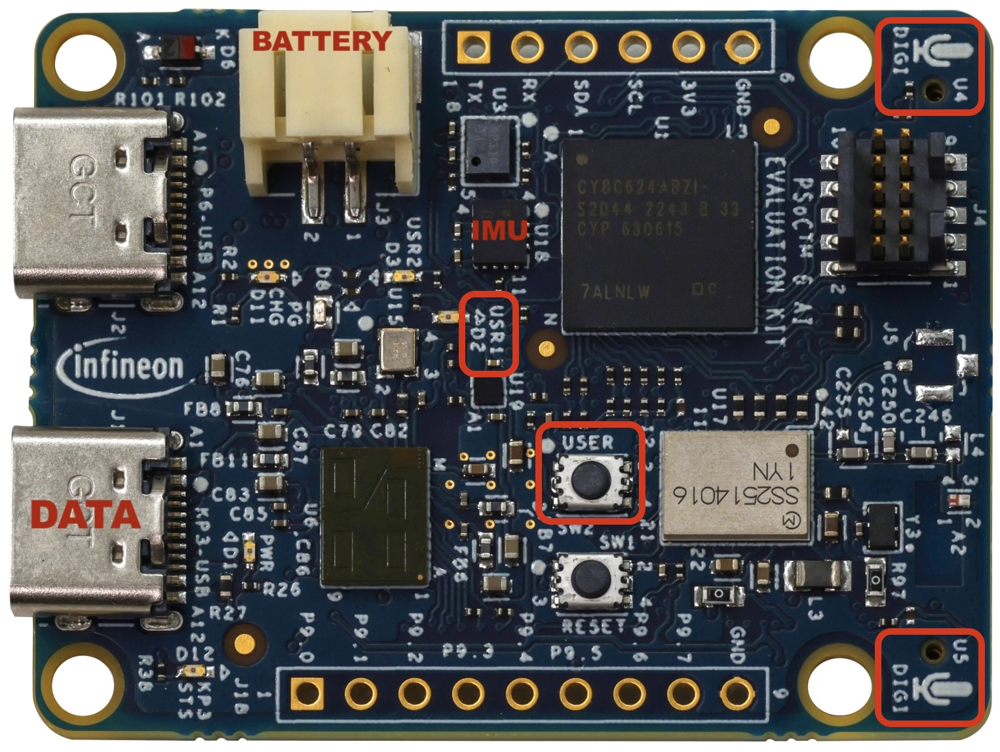

# Doppler Pendulum Project

*Material for a [UC Irvine](https://uci.edu/) course offered by the [Department of Physics Astronomy](https://www.physics.uci.edu/) and developed by [David Kirkby](https://faculty.sites.uci.edu/dkirkby/).*

## Introduction

The goal of this activity is to perform a novel physics experiment using components in your kit together with a new module called a PSoC6 Evaluation Kit that is significantly more powerful than a PicoW and which includes many of the same sensors in your kit.

The goal of the experiment is to study:
 - the acceleration experienced by a swinging pendulum bob
 - the Doppler shift of a stationary tone generator observed by a swinging pendulum bob

## Equipment

Each numbered bag contains:
- pendulum fixture made of 3 laser-cut plastic parts
- 3.7V LiPo rechargeable battery, connected to the plastic parts with 2 rubber bands
- PSoC6 evaluation kit
- string looped through the plastic parts and bundled up with a rubber band

Make a note of your bag's number.

The battery cable should be disconnected now. You will connect it later to start the program running on the PSoC6. There is no on/off switch, just like with your PicoW modules.

Drawings for the laser-cut plastic parts are [here](https://github.com/dkirkby/pendulum-doppler/blob/c4a3a23339414bcdc50123baae7955579e4161d6/laser/laser-parts.jpg)

## PSoC6 Evaluation Kit Overview

[Manual](https://www.infineon.com/assets/row/public/documents/30/44/infineon-cy8ckit-062s2-user-guide-usermanual-en.pdf)

Kindly donated by [infineon technologies](https://www.infineon.com/).

The program source code is written in C and [available on github](https://github.com/dkirkby/pendulum-doppler). The code monitors the USER button, controls the USR1 red LED, reads out the IMU accelerometer and one of the microphones, and dumps data to one of the USB ports.

## Build PicoW Circuit

- Build and program a circuit using a PicoW, speaker and DPS310 (pressure & altitude) module to:
  - output 2KHz sine wave
  - measure air temp using Barometer I2C module
- install the [phyphox app](https://phyphox.org/) on a phone and use the *Audio Scope* and *Frequency History* tools to verify your sine wave
  - if you have trouble generating a 2KHz sine wave, you can use the phyphox *Tone Generator* instead

## Calculate Sound Speed

- Look up relative humidity online
- use NB#1 to calculate speed in m/s
- estimate uncertainty in speed assuming RH error of 10% and temp error of 1°C

## Install Serial Terminal

- Download and install CoolTerm from [here](https://freeware.the-meiers.org/)
- Click on the down arrow in the bottom-left corner of CoolTerm and select Port. Make a note of which ports are listed. Later, you will see a new port listed here that you will connect to.

### Mac Security Instructions
 - Try to run CoolTerm, but it will be blocked by the OS. Click "Cancel" (do not click the "Delete" option).
 - Open your System Settings and navigate to "Privacy & Security"
 - Scroll down to the Security section. You should see a note saying something like "CoolTerm was blocked from opening because it is not from an identified developer."
 - Click the Open Anyway button
 - You will be prompted for your Mac password or Touch ID
 - Try to run CoolTerm again. A final dialog will appear asking if you're sure.

## Collect Calibration Data

 - connect battery to PSoC6 module
 - img showing what LEDs should look like and identifying USR button
 - turn on 2KHz tone
 - press the USER button and leave the fixture stationary, without disturbing it
 - a red LED will flash slowly for 5s then rapidly for 64s
 - the initial 5s is to let the fixture settle, then data is recorded during the 64s
 - turn off 2KHz tone
 - leave the battery connected

## Download Calibration Data

 - Connect a USB cable to the connector marked "DATA" in the diagram above. You can leave the battery connected.
 - Connect the other end of the cable to the laptop where CoolTerm is installed.
 - Click on the down arrow in the bottom-left corner of CoolTerm to select:
  - the new port that should now appear
  - a baud rate of 115200
 - Start capturing data to a file using the "Connection > File Capture > Start..." menu item. Select "idle.csv" for your filename.
 - Type "d" in the terminal window. You should see many lines of numbers fly by, which are being captured to your CSV file.
 - Close the file using the "Connection > File Capture > Stop" menu item.

## Analyze the Calibration Data

 - Use NB#2 to load your CSV file.
 - ...

## Collect Pendulum Data

 - Remove the rubber band around the string and practice swinging the pendulum with the upper piece held a fixed distance above the floor. Aim for only a small gap (10-20cm) between the bottom of the pendulum arc and the floor.
 - Estimate the distance from the pivot point to the microphones, i.e. the length of your pendulum.
 - Mark a point on the floor that your pivot will be hand held above. Mark a distance about 60cm away, which is where you will launch the pendulum from. It is not necessary to measure this distance precisely.
 - Mark a distance of about 40cm away from the pivot, towards the 60cm mark. Place your tone generator at this point (but leave it quiet for now). It is not necessary to measure this distance precisely.
 - The procedure to start collecting data with the USER button is the same as before, but you also have the option to press the USER button a second time to stop collecting data before it stops automatically after 64s.
 - One person holds the pivot point as steady as possible.
 - The other person holds the PSoC6 module and battery assembly out at an angle, ready to press the button then launch. You should launch from the same side as your tone generator, and starting a bit beyond it. Remember that data collection does not start for 5s after you press the button.
 - Let the pendulum swing for up to 64s, as long as it is still in motion, following a nice arc in its original plane.

## Download Pendulum Data

 - Download following the same instructions as above, but using "swing.csv" for your filename.

## Analyze Pendulum Data

- Use NB#3 to load your CSV file.
- ...

## What to upload to Canvas...

 - ...

## Cleanup

 - Gently remove the battery cable from the PSoC6 connector
 - Roll up the string and secure with the original rubber band
 - Put all contents back in the bag
 - Turn in the bag
