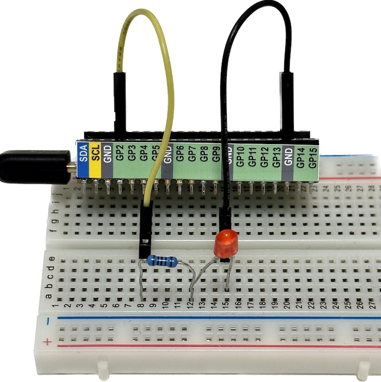
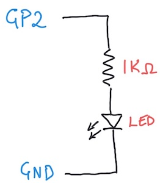
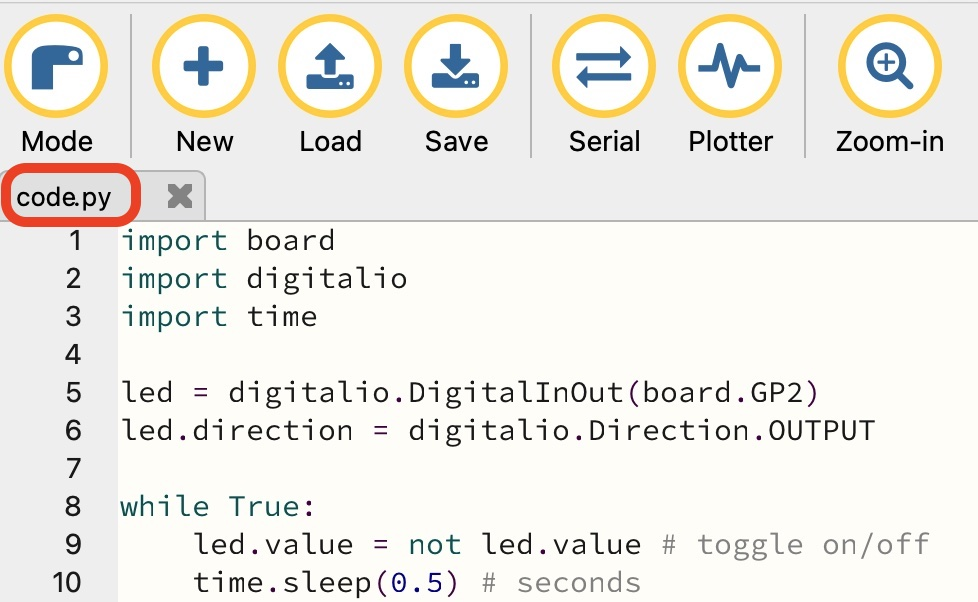

# Your First Circuit and Program

*Material for a [UC Irvine](https://uci.edu/) course offered by the [Department of Physics Astronomy](https://www.physics.uci.edu/) and developed by [David Kirkby](https://faculty.sites.uci.edu/dkirkby/).*

Build the circuit below using a Pico W microcontroller (not yet connected to your laptop via USB), a 1KΩ resistor, a red or green LED (your choice), your breadboard and some jumper wires:



Note that an LED is directional, i.e. does not work the same way forwards and backwards. This means you need to insert it into your breadboard with the correct orientation.  Don't worry if you get this wrong since it will not do any damage. In this case, the longer wire on the LED should be connected to the resistor (through a hidden breadboard wire).

The corresponding electrical circuit diagram is:



> **Why the resistor?** A diode is not a linear component that obeys $V = iR$. Instead, it has a [non-linear voltage versus current curve](https://learn.sparkfun.com/tutorials/diodes/real-diode-characteristics). In this circuit, the diode operates in its forward-biased mode, so effectively has a fixed voltage drop of $\Delta V = 2--3$ V. The remaining voltage drop across the resistor $V_{3.3} - \Delta V$ determines the current flowing through both the resistor and diode, $i = (V_{3.3} - \Delta V)/R$, which is proportional to the resulting light intensity. Therefore a forward-biased diode always requires a sufficiently large series resistance $R$ to avoid $i \rightarrow \infty$.

The light-green microcontroller pins labeled **GP2, GP3, GP4, ...** are for general-purpose digital input and output. In this context, *digital* means that signals are represented by a voltage that is either close to 0V ("low") or close to 3.3V ("high").
To complete your circuit, connect the Pico W to your laptop with a USB cable.  This will apply power to your circuit (from your laptop's USB port) and start running any previously loaded program, but there probably won't be any sign of this.

To bring this circuit to life, enter the following program into your Mu editor:
```python
import board
import digitalio
import time

led = digitalio.DigitalInOut(board.GP2)
led.direction = digitalio.Direction.OUTPUT

while True:
    led.value = not led.value # toggle on/off
    time.sleep(0.5) # seconds
```
To load this program into the RP2020 processor on your Pico W board, you simply save it in the Mu editor.  This triggers the Mu editor to download your program via the USB cable and reset the processor so it starts running your code.  If all goes well, you should now see your LED blinking once per second. It is important that your program is saved to the top level of your **CIRCUITPY** drive (so not under the `lib` folder) with the name `code.py` since this is what CircuitPython expects. Check the name in the Mu editor tab, circled in red below:



> In case your program is saved with a different name, it will not be running. To fix this, double click on its name in the Mu editor tab to open a dialog where you can re-save it as `code.py`

If you already have experience with python programming, you might notice a few new features in the MicroPython world. First, the imported `board` and `digitalio` modules are specific to your Pico W microcontroller board. Second, the `digitalio` module allows you to control a (digital) voltage in your circuit as if it were a normal python variable, with `True` corresponding to the "high" (3.3V) logic level and `False` corresponding to "low" (0V). You will soon learn how to control an analog voltage (with values anywhere between 0 and 3.3V) and measure both digital and analog voltages in your circuit.

Here are some experiments to try with your circuit and code. For each one, predict what might happen, try it then, in case you are surprised, think about why. The circuit changes below can be safely performed while your Pico is powered via USB.
 - Turn the LED around
 - Remove the resistor
 - Replace the 1KΩ resistor with a 10KΩ resistor (and review **Why the resistor?** above)
 - Change the 0.5 second delay to something much smaller or bigger
 - Use a different GND pin on the Pico W
 - Use a different GPn pin on the Pico W (can you modify your code to make this work?)
 - Unmount the **CIRCUITPY** USB drive from your laptop and plug it into a USB charger
