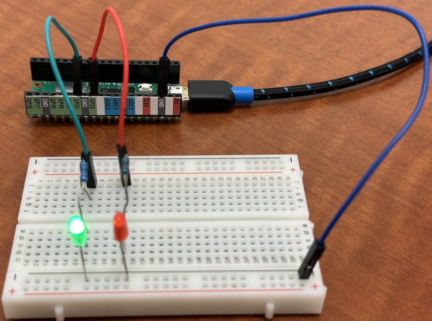
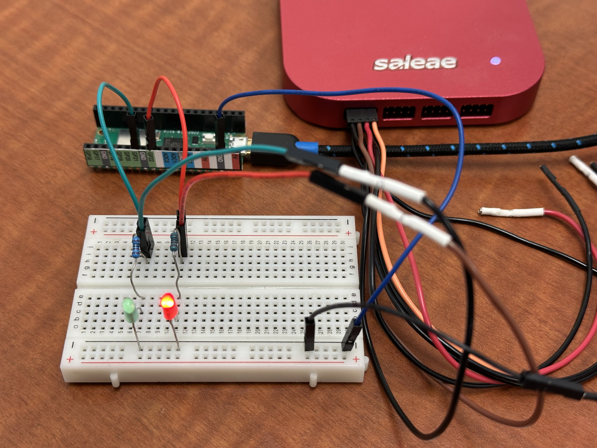
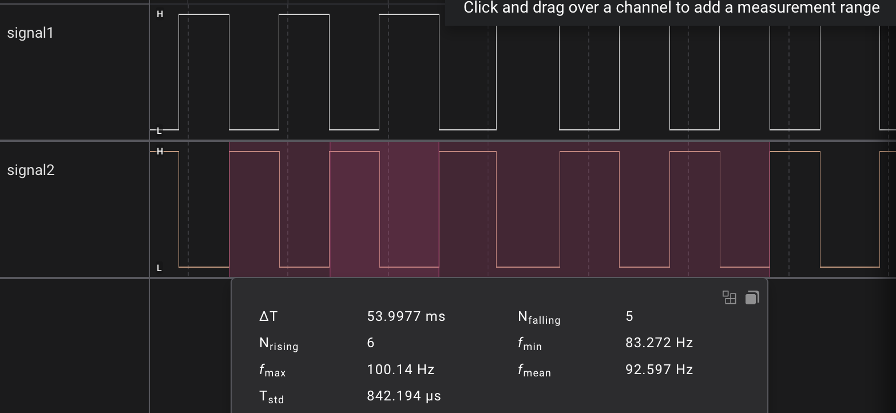
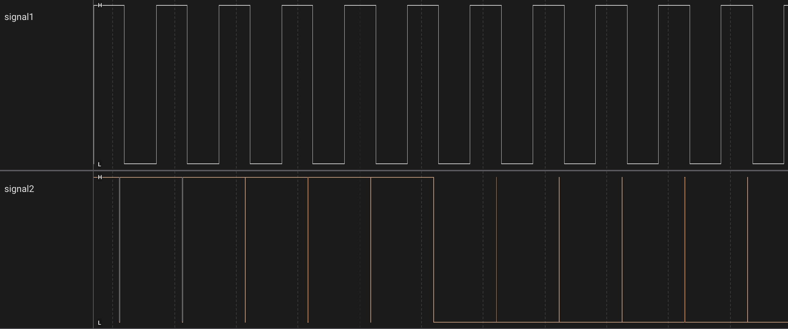
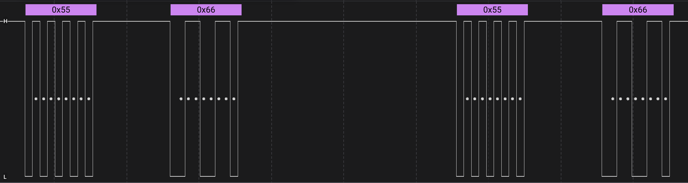
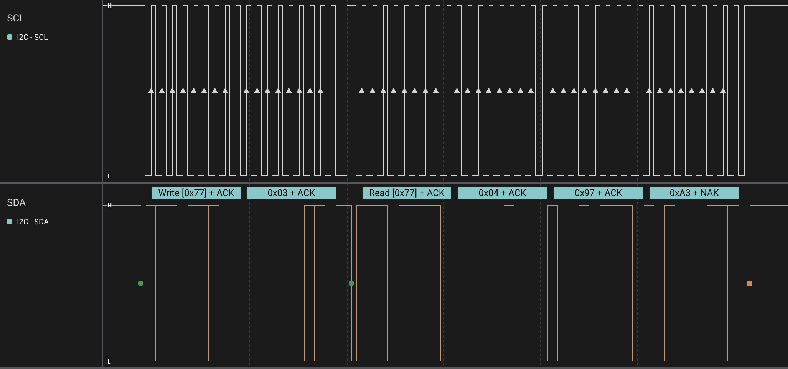

# Hardware Debugging Techniques

*Material for a [UC Irvine](https://uci.edu/) course offered by the [Department of Physics Astronomy](https://www.physics.uci.edu/) and developed by [David Kirkby](https://faculty.sites.uci.edu/dkirkby/).*

## Introduction

When you are developing python code to run on a Pico, it is very helpful to be able to add `print(...)` statements to trace your program's flow and inspect variables. What are the modern equivalents for debugging your circuit? Ideally, we want to know how the high/low states of the digital signals in the circuit are changing as the circuit operates.

In simple cases, where signals are changing slowly, you can still use print statements or add indicator LEDs. For example, we can trace two slowly changing digital signals like this:
```python
import time
import board
import digitalio

signal1 = digitalio.DigitalInOut(board.GP21)
signal1.direction = digitalio.Direction.OUTPUT

signal2 = digitalio.DigitalInOut(board.GP22)
signal2.direction = digitalio.Direction.OUTPUT

signal1.value = True
signal2.value = False

while True:
    signal1.value = not signal1.value
    signal2.value = not signal2.value
    print(f'signal1={signal1.value} signal2={signal2.value}')
    time.sleep(0.5)
```

Add indicator LEDs with a simple circuit like this:



This works fine when the signals change at 2Hz, but if you change the delay from 0.5 to 0.05 (20Hz), the print statements are now too fast to be useful but the LED flashing is still visible. Change the delay to 0.005 (200Hz) and now even the LEDs are no longer useful. Note that print statements inside a fast loop can slow down the loop to the point that adding or removing them might change whether your circuit works as expected!

## Logic Analyzers

A [logic analyzer](https://en.wikipedia.org/wiki/Logic_analyzer) is a hardware device that captures and displays multiple digital signals. It is similar to an oscilloscope but generally handles more signals (compared with 2 or 4 for a scope) but only records their digital (high/low) state. Traditional logic analyzers have displays and lots of buttons, but modern analyzers are often USB based and rely on a separate computer for the display and controls. The examples below use a USB-based [Salae Logic Pro 16](https://www.saleae.com/products/saleae-logic-pro-16), which costs about US$1500 in 2025 and and capture 16 digital signals simultaneously.

Connect the logic analyzer to the circuit above:



Capture some data, which looks like this:



Note how the spacing of the pulses varies quite a bit: this is a normal consequence of using CircuitPython and can be avoided by using a lower-level language like C. Note also that the average loop time is 5.4ms, so the instructions inside the loop are taking about 0.4ms to execute, adding to the requested 5.0ms delay.

### Pulse Width Modulation

Let's use the logic analyzer to take a closer look at pulse-width modulation (PWM) used to ramp the LEDs. Here is the program we will test (with no print statements this time):
```python
import time
import board
import pwmio

signal1 = pwmio.PWMOut(board.GP21, frequency=1000)
signal2 = pwmio.PWMOut(board.GP22, frequency=1000)

signal1.duty_cycle = 0x0000
signal2.duty_cycle = 0x8000

while True:
    signal1.duty_cycle = (signal1.duty_cycle + 0x0100) % 0xffff
    signal2.duty_cycle = (signal2.duty_cycle + 0x0100) % 0xffff
    time.sleep(0.005)
```
If you watch the LEDs, you will see that their brightness traces out a "sawtooth" pattern, i.e. a linear ramp upwards then a sudden reset back to zero, cycling forever. However, the two LEDs are out of phase with each other. Study the code to identify how each of these features is accomplished:
 - linear ramp
 - reset to zero
 - out of phase

Although the LED brightness appears to vary smoothly, we know that PWM actually toggles the brightness rapidly between on/off states. Use the logic analyzer to verify this. Here is a sample trace centered on the moment when `signal1` is at 50% duty cycle and `signal2` resets from 100% to 0% duty cycle:




**Exercise:** change the code for a slower ramp. Hint: there are 2 different ways you can do this.

**Exercise:** change the code to have the brightness ramp up then down (triangle wave) instead of resetting to zero after ramping up (sawtooth wave).

### UART Communication

One of the earliest standards for digital communication uses a [Universal Asynchronous Receiver-Transmitter](https://en.wikipedia.org/wiki/Universal_asynchronous_receiver-transmitter) (UART) and allows data (including text) to be sent serially (i.e. one bit at a time) in both directions using separate transmit (Tx) and receive (Rx) wires. UART communication is often used to interface with devices like GPS modules, although USB is becoming more universal.

The Pico supports UART communications, and uses it to implement the Serial link that enables us to see the output from `print` statements in the Mu Editor. However, only certain pins support UART, as identified in purple in this pinout diagram:


Move the wire connected to the green LED from GP21 to GP4 (on the other side of the Pico W) and test UART communication with the following program:
```python
import time
import board
import busio

UART = busio.UART(tx=board.GP4, rx=board.GP5, baudrate=9600)

data1 = bytearray([0x55])
data2 = bytearray([0x66])

while True:
    UART.write(data1)
    time.sleep(0.002)
    UART.write(data2)
    time.sleep(0.004)
```

Note that we are sending 0x55 followed by 0x66 in the inner loop. Lookup these codes in an [ASCII chart](https://www.ascii-code.com/) to discover their alternate representations:
 - hex 0x55 = decimal 85 = binary 01010101 = ASCII 'U'
 - hex 0x66 = decimal 102 = binary 01100110 = ASCII 'f'

A good logic analyzer is able to interpret the digital data stream associated with different communications protocols and display a higher-level summary of the data. For example, with the Logic Pro analyzer, we can enable an "Async Serial" analyzer with the transmit wire (Tx = GP4), then we see:



Notice how each of the 8 individual data bits is identified with a dot and each group of eight is translated into its hex equivalent (0x55 or 0x66). Also note that each packet of data has an additional start bit and that the idle state is high (+3.3V). Use the "Terminal" view in the Logic Pro Analyzers tab to confirm that the transmitted data corresponds to alternating `UfUfUfUf...` characters.

For a more complex example, change the transmitted data above to:
```python
data1 = bytearray('Hello, world!', 'utf-8')
data2 = bytearray('Bonjour, monde!', 'utf-8')
```

## I2C Communication

As another example of protocol analysis on the logic analyzer, let's look at I2C. Move the wires connecting the green and red LEDs to SCL and SDA, then install the I2C cable connected to the pressure sensor. Load the code we used earlier to test this sensor, but with the sleep time reduced from 1.0 to 0.01 seconds, and verify that we get the expected serial output:
```python
import time
import board
import busio

sda, scl = board.GP0, board.GP1

i2c = busio.I2C(sda=sda, scl=scl)

# This file is not in the base CircuitPython installation.
# See instructions above for installing it and its dependencies.
import adafruit_dps310

tpsensor = adafruit_dps310.DPS310(i2c)

while True:
    temperature = tpsensor.temperature
    pressure = tpsensor.pressure
    print(f'T = {temperature:.2f} C, P = {pressure:.2f} hPa')
    time.sleep(0.01) # changed from 1
```

Here is an example LogicPro trace with an I2C protocol analyzer enabled:



This is a more complex protocol than our UART example above, and running at higher speed in both directions. When the low-level protocol (start bits, etc) is working, this technique allows us to view the actual data inside each I2C packet and debug the code that reads and writes this data. In case there is a problem and the protocol is not working, a trace like this is essential for identifying and fixing the problem.
