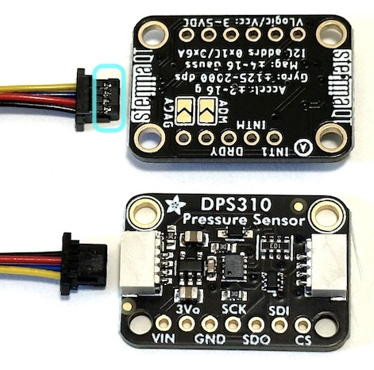
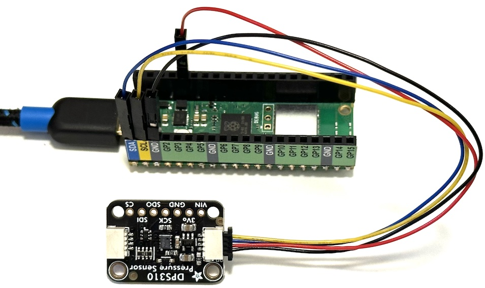

# I2C Communication and Modules

*Material for a [UC Irvine](https://uci.edu/) course offered by the [Department of Physics Astronomy](https://www.physics.uci.edu/) and developed by [David Kirkby](https://faculty.sites.uci.edu/dkirkby/).*

## Introduction

There is no universal digital communications standard since different settings have different needs and constraints. Some popular standards and their settings are:
 - ethernet: connects computers onto a shared bus.
 - USB: connects external periphals (mouse, keyboard, ...) to a computer.
 - PCI, SATA: connects internal peripherals (GPU, disk, ...) to a computer.
 - I2C, SPI: connects devices within a computer.

Most modern standards transmit data serially, rather than in parallel, which reduces the wiring cost while also lowering the data rate.  Modern devices are fast enough that this is usually the best choice.  However, for the fastest connections, typically with no cabling, parallel solutions like PCI are needed.

In general, any digital communication protocol must define the voltage levels it uses, typically with VCC and GND wires.  In addition, some wires to carry data are needed: 1 for serial, or many (typically a multiple of 8) for parallel. Data wires are usually bi-directional. Finally, additional wires are often needed for control signals to synchronize transmitters and receivers. Synchronization usually involves either clock signal (synchronous) or a special handshake (asynchronous). The simplest synchronization involves sending a start bit on the data line. Protocols that support communication between more than 2 devices also require control signals to arbitrate who is transmitting at any one time.

## I2C

[I2C](https://en.wikipedia.org/wiki/I%C2%B2C) stands for "inter-integrated circuit" and is a low-cost synchronous serial protocol suitable for connecting low-cost devices such as we have in the [kit](kit.md).  The protocol uses 4 wires:
 - Ground (GND)
 - Power (3.3V)
 - Serial data
 - Synchronous clock

The I2C-capable modules in your kit all use the same connector, which goes by two different names depending on the vendor:
 - [QT](https://learn.adafruit.com/introducing-adafruit-stemma-qt/what-is-stemma-qt) from Adafruit
 - [QWIIC](https://www.sparkfun.com/qwiic) from Sparkfun

Pull out the bag in your kit containing the I2C cables. Notice how some have jumper pins on one end and the others have QT/QWIIC connectors on both ends.

The I2C-capable modules in your kit are:
 - [pressure & altitude](https://www.adafruit.com/product/4494)
 - [acceleration & rotation & magnetic field](https://www.adafruit.com/product/5543)
 - [10-band photodetector](https://www.adafruit.com/product/4698)
 - [128x32 OLED display](https://www.adafruit.com/product/4440)

Pull these out now and look for the QT/QWIIC connectors. Three are sensor modules that have 2 connectors: the second connector allows you to chain multiple modules on the same I2C bus, using the cables with connectors on both ends.  The last module is a display that only has one connector, but you can always put this at the end of a chain.

The connectors are small and plastic, so can be damaged if inserted or removed with too much force. Pay special attention to the orientation of the cable connector when inserting it into a module connector. The connector is "keyed" so only inserts smoothly one way, but you could still force it the other way and do some damage.  Tip: the side of the cable connector with shiny metal showing through (circled below) should be facing down when looking at the connector side of the module:



To remove an I2C cable connector from a module, gently pry it out using the small tabs on each side.

## Using I2C with Pico

With your Pico disconnected from USB, use one of the I2C cables with jumper pins on one end to make the following connections:
- I2C black wire to Pico GND
- I2C red wire to Pico 3.3V
- I2C blue wire to Pico SDA (data)
- I2C yellow wire to Pico SCL (clock)

Notice how the Pico pin sticker conveniently uses the same blue/yellow colors as the cable. Use the Pico GND next to SCL to keep your circuit tidy.  Finally, connect the pressure sensor module to the other end of this cable. Your first I2C circuit should now look like this:



Note that you should generally eject / unmount your Pico USB device on your laptop and disconnect the cable (to remove power) before making connecting or disconnecting I2C connectors.  If you skip this step, you will probably not do any permanent damage but may need to reset your Pico.

CircuitPython has a [dedicated library](https://docs.circuitpython.org/en/latest/shared-bindings/busio/index.html) to handle I2C communication.  Try it out with this program:
```python
import time
import board
import busio

sda, scl = board.GP0, board.GP1

i2c = busio.I2C(sda=sda, scl=scl)
i2c.unlock()

DELAY = 1
print(f'Will scan I2C bus every {DELAY} second(s).')

while True:
    if i2c.try_lock():
        devices = i2c.scan()
        print(f'Found {len(devices)} device(s): {[hex(id) for id in devices]}')
        i2c.unlock()
    time.sleep(DELAY)
```
This program makes no assumptions about what you have connected to your I2C bus and just prints out the identifier for any connected devices it finds.  An identifier should be unique on the bus and is a small number, usually displayed in hex, in the range 0x08 - 0x77.  When you run this program and open the Mu Serial window, you should see a single identifier printed for your pressure sensor module.

Repeat this process for each of your other three I2C devices, remembering to power off the bus before making any cable changes.  Record all of the identifiers you discover.

Finally, connect all three of your sensor modules (omitting the OLED display) so that they are chained together on a single I2C bus.  The order does not matter.  What does the program output now.  Can you infer the order in which things are connected from the order of identifiers printed?

## Pressure Sensor

Using the same circuit, with all three sensors connected, change your program to specifically target the pressure sensor using the CircuitPython [DPS310 library](https://docs.circuitpython.org/projects/dps310/en/latest/index.html):
```python
import time
import board
import busio

sda, scl = board.GP0, board.GP1

i2c = busio.I2C(sda=sda, scl=scl)

# This file is not in the base CircuitPython installation.
# See instructions above for installing it and its dependencies.
import adafruit_dps310

tpsensor = adafruit_dps310.DPS310(i2c)

while True:
    temperature = tpsensor.temperature
    pressure = tpsensor.pressure
    print(f'T = {temperature:.2f} C, P = {pressure:.2f} hPa')
    time.sleep(1)
```
Note how having other I2C modules on the bus has no effect and they are simply inactive if we do not send them any data.

What are the units of the pressure reading?  How does this compare to normal atmospheric pressure at sea level?

Observe and estimate the level of noise in the temperature and pressure readings.

Try moving the sensor vertically (you can also move the Pico with it). Can you detect a systematic change in pressure with height, that is distinguishable from noise?  If so, make a rough estimate of the change in pressure corresponding to 1 meter of elevation change.

## 10-Band Photodetector

The [photodetector module](https://www.adafruit.com/product/4698) in your kit measures the light intensity in ten different "bands" (wavelength ranges).  There is a dedicated [CircuitPython library](https://docs.circuitpython.org/projects/as7341/en/latest/index.html) for communicating with this device. Try it out using this program:
```python
import time
import math

import board
import busio

sda, scl = board.GP0, board.GP1

i2c = busio.I2C(sda=sda, scl=scl)

# These files are not in the base CircuitPython installation.
# See instructions above for installing them.
import adafruit_as7341

multispec = adafruit_as7341.AS7341(i2c)

# Use a gain of 256X to match most of the curves in Fig.18 of the datasheet.
multispec.gain = adafruit_as7341.Gain.GAIN_256X

# List the available bands.
bands = ['415nm','445nm','480nm','515nm','555nm','590nm','630nm','680nm','clear','nir']

# An on-board "white" LED provides consistent illumination for measuring
# the spectrum of reflected light from a surface.
USE_LED = False

# Configure the LED.
multispec.led_current = 25 # mA
multispec.led = USE_LED

# Disable flicker detection.
multispec.flicker_detection_enabled = False

# Display a simple horizontal histogram using text.
LINE_LENGTH = 120

separator = '-' * LINE_LENGTH

def bar(value, max_value=10000, max_length=LINE_LENGTH - 11):
    length = int(round((value / max_value) * max_length))
    return '#' * length

# Main loop reads sensors and displays the measured spectrum.
LOG2 = math.log(2)
while True:
    fluxes = [getattr(multispec, 'channel_' + band) for band in bands]
    log2_fluxes = [math.log(max(1,flux)) / LOG2 for flux in fluxes]
    for i, band in enumerate(bands):
        print(f'{band:5s} {fluxes[i]:04x} {bar(log2_fluxes[i], max_value=16)}')
    print(separator)
    time.sleep(0.5)
```
Look up the range of wavelengths in nanometers (nm) corresponding to the visible spectrum and compare with the central wavelengths of each band that are printed to the Serial Window.  Look at the code and note that the measured fluxes in each band are displayed as a bar chart using logarithm (not linear) scaling.

Compare the filter curves for each band from the [AS7341 datasheet](datasheets/multispec.pdf) with the [response curves](http://hyperphysics.phy-astr.gsu.edu/hbase/vision/colcon.html) for cones in the human eye.

Observe and estimate the level of noise in each band.

Try setting `USE_LED = True` and describe what happens.  Why might this be useful?  Hint: try placing different colored surfaces close to the device when the LED is on and compare the printed results.

## Acceleration, Rotation and Magnetic Field Sensor

The [inertial-measurement unit](https://www.adafruit.com/product/5543) (IMU) in your kit measures three separate vectors (so nine numbers in total):
 - net acceleration due to gravity and any other applied forces
 - rotational axis and angular velocity
 - magnetic field strength

CircuitPython has two dedicated libraries for communication with this module: one for the [magnetic sensing device](https://docs.circuitpython.org/projects/lis3mdl/en/latest/index.html) and one for the [acceleration and rotation sensing device](https://docs.circuitpython.org/projects/lsm6dsox/en/latest/api.html). Try it out with this program:
```python
import time
import math

import board
import busio

sda, scl = board.GP0, board.GP1

i2c = busio.I2C(sda=sda, scl=scl)

# These files are not in the base CircuitPython installation.
# See instructions above for installing them and their dependencies.
import adafruit_lis3mdl
import adafruit_lsm6ds.lsm6ds3

bsens = adafruit_lis3mdl.LIS3MDL(i2c)
imu = adafruit_lsm6ds.lsm6ds3.LSM6DS3(i2c)

def magnitude(vec):
    return math.sqrt(vec[0] * vec[0] + vec[1] * vec[1] + vec[2] * vec[2])

while True:
    # Read the magnetic field strength vector in micro Teslas.
    bfield = bsens.magnetic
    # Calculate the magnitude of the B field which should be about 47 uT in Irvine.
    bmag = magnitude(bfield)
    print(f'B=({bfield[0]:.2f},{bfield[1]:.2f},{bfield[2]:.2f}) |B|={bmag} uT')
    # Read acceleration vector in m/s^2.
    accel = imu.acceleration
    # Calculate the magnitude of the acceleration vector which should be 9.81 m/s^2 at rest.
    amag = magnitude(accel)
    print(f'accel=({accel[0]:.2f},{accel[1]:.2f},{accel[2]:.2f}) |a|={amag:.2f} m/s^2')
    # Read angular velocity vector in rad/s which should be ~0 at rest.
    gyro = imu.gyro
    # Convert from rad/s to deg/s.
    gdeg = [math.degrees(g) for g in gyro]
    gmag = magnitude(gdeg)
    print(f'omega=({gdeg[0]:.1f},{gdeg[1]:.1f},{gdeg[2]:.1f}) |omega|={gmag:.1f} deg/s')
    time.sleep(1)
```

Observe and estimate the level of noise for each measured quantity.

Does the acceleration magnitude make sense when the module is at rest? Try moving the module and observe the effect on the measured acceleration. Note the XYZ right-handed coordinate axes on the module's silkscreen. What acceleration measurement would you expect if you dropped your module, while it is free fall?

What is the earth's magnetic field strength in Irvine?  (Check this [map](https://www.ngdc.noaa.gov/geomag/WMM/data/WMM2020/WMM2020_F_BoZ_MILL.pdf))  Do your measurements agree with this?  The magnetic sensor does not distinguish between the earth's weak magnetic field and other sources.  Try moving the speaker module from your kit close to the sensor and observe its effect.

Does the measured rotation make sense when the module is stationary?

## OLED Display

The [OLED display](https://www.adafruit.com/product/4440) in your kit has a very small resolution of 128x32 pixels, but this is sufficient to display three short (up to 21 characters) lines of text.  CircuitPython needs several libraries to accomplish this, as you can see in this example program:
```python
import time
import board
import busio
import displayio
import terminalio
import i2cdisplaybus
from adafruit_display_text import label
import adafruit_displayio_ssd1306

WIDTH = 128
HEIGHT = 32

DISPLAY_LINES = 3
LINE_HEIGHT = 12
MAX_DISPLAY_CHARS = 21

ALIGN_LEFT = 0
ALIGN_RIGHT = 1
ALIGN_CENTER = 2

def display_text(line, text, align=ALIGN_LEFT):
    trimmed = text[:MAX_DISPLAY_CHARS]
    if align == ALIGN_RIGHT:
        npad = MAX_DISPLAY_CHARS - len(trimmed)
    elif align == ALIGN_CENTER:
        npad = (MAX_DISPLAY_CHARS - len(trimmed)) // 2
    else:
        npad = 0
    display_lines[line % DISPLAY_LINES].text = (' ' * npad) + trimmed

# Use GP0 and GP1 as the I2C control signals.
sda, scl = board.GP0, board.GP1

with busio.I2C(sda=sda, scl=scl) as i2c:

    displayio.release_displays()
    display_bus = i2cdisplaybus.I2CDisplayBus(i2c, device_address=0x3c)
    display = adafruit_displayio_ssd1306.SSD1306(display_bus, width=WIDTH, height=HEIGHT)

    splash = displayio.Group()
    display.root_group = splash
    display_lines = []

    for i in range(DISPLAY_LINES):
        display_lines.append(
            label.Label(terminalio.FONT, text='', color=0xffffff, x=0, y=LINE_HEIGHT * i + 4))
        splash.append(display_lines[-1])

    while True:
        display_text(0, 'Electronics', ALIGN_LEFT)
        display_text(1, 'for Scientists', ALIGN_CENTER)
        display_text(2, 'P120/220', ALIGN_RIGHT)
        time.sleep(1)
```

Power off your USB bus and connect just the IMU and OLED display, then load the program above. Check that you can read three lines of text on your display.  Study the code above to discover how the displayed text and specified and aligned (left / center / right) on each line.

## Exercise

Using the same circuit, combine the IMU and OLED programs to display the magnitudes of the acceleration, rotation and magnetic field on the OLED display once per second.

## Exercise

Use the joystick to move a circle around the display in X and Y. Toggle between displaying a circle and X when the joystick is pressed.
