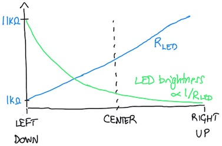
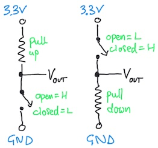

# Digital and Analog Inputs

*Material for a [UC Irvine](https://uci.edu/) course offered by the [Department of Physics Astronomy](https://www.physics.uci.edu/) and developed by [David Kirkby](https://faculty.sites.uci.edu/dkirkby/).*

In this activity, you will learn how to use the joystick as a physical input of both digital and analog information. You will first use the joystick to control and LED, then learn how to read the joystick's digital and analog state using the microcontroller.  This activity assumes you have already [setup your microcontroller](setup.md) and [built your first circuit](first-prog.md).

## An LED Circuit using USB Power

Build the circuit below using a Pico W microcontroller (not yet connected to your laptop via USB), a 1KΩ resistor, a red or green LED (your choice), your breadboard and some jumper wires:


The corresponding circuit diagram is:


The completed circuit should illuminate the LED. If it doesn't, check the polarity of your LED and trace the current path from 3.3V to GND through your breadboard, making sure that it matches the circuit diagram. Notice how we connect the power (3.3V) and ground (GND) to opposite sides of the breadboard, instead of using the + and - lines on one side: this is to minimize the chances of accidentally shorting power and ground, which will crash your microcontroller (without doing permanent damage).

Although this circuit looks similar to your [first circuit](first-prog.md), here we are only connecting to the Pico W power (3.3V) and ground pins. This is a convenient way to power a breadboard circuit via your laptop's USB cable. Since there are no connections to any GPn or ADCn pins, there is nothing for a python program to do in this circuit, and any program already loaded in your Pico W will have no effect.

This is a good time to review the **Why the resistor?** note from your [first circuit writeup](first-prog.md).

Recall that a digital signal has only two states, which we can label HI / LO (or 1 / 0).  In this circuit, the electrical characteristics of these states are voltage levels of about 3.3V and 0V, and the LED acts as a digital output.

## Use a Joystick as a Digital Input

Experiment with the joystick in your kit to discover the three different ways you can iteract with it:
 - Press and release (which should both produce an audible click) to open and close a switch between the **GND** and **Sel** pins.
 - Push left and right to vary the resistances between the **GND** - **Xout** and **Xout** - **VCC** pins.
 - Push up and down to  vary the resistances between the **GND** - **Yout** and **Yout** - **VCC** pins.

Note that the **GND** and **VCC** joystick pin labels are slightly misleading since you are not *required* to connect these to the **GND** and **VCC** (3.3V) signals in your circuit, even though that is often a good idea.

Since the press / release action opens and closes a switch, there are only two states and this serves as a digital input. Connect two identical wires of the same color (but avoiding red and black since, by convention, these are reserved for power and ground) to the joystick's **GND** and **Sel** pins, then replace the black wire with the free ends of your joystick wires, as shown below:


Verify that when you press down on the joystick, the LED illuminates: you have now connected a digital input (switch) to a digital output (LED).

What do you think would happen if you replaced other wires in the original circuit with the switch?  Try it.

There are several different ways that switches are draw in circuit diagrams, including those below:


## Use a Joystick as an Analog Input

Next, we will use the left-right motion of the joystick as an analog signal to control the LED brightness. In this mode, each axis (X/Y) of the joystick serves as an independent [variable resistor or potentiometer ("pot")](https://learn.adafruit.com/make-it-change-potentiometers?view=all).  A potentiometer consists of two resistors R1 and R2 connected in series, within a single package, such that R1 + R2 = RTOT is fixed (at 10KΩ for the joystick). The diagram shows a standard potentiometer circuit symbol next to its equivalent circuit involving R1 and R2:


Moving the joystick left/right or up/down (or rotating a rotary potentiometer) varies how RTOT is split between R1 and R2:


The pin between R1 and R2 for left/right joystick motion is labeled **Xout**. There pin **Yout** is between R1 and R2 for a separate potentiometer controlled by up/down joystick motion.  Both joystick potentiometers have RTOT = 10KΩ.

The circuit already has a 1KΩ resistor that controls the LED brightness.  To vary this resistance smoothly (i.e. in an "analog" fashion), add the left/right potentiometer's R1 in series with the existing 1KΩ resistor. In other words, replace the jumper wire between the 1KΩ resistor and LED with two jumper wires connected to the joystick **GND** and **Xout** pins, as shown below:


By moving the joystick left to right you can now smoothly vary the resistance RLED in series with the LED from 1KΩ to 11KΩ. Note how this varies the LED brightness, but why does it vary more to the left (brighter) than the right (fainter)? The answer is that the brightness depends on the current flowing through the LED, which is proportional to 1/RLED:



## Read a Digital Input with the Microcontroller

Earlier you built a circuit where your joystick switch provided digital control of an LED. Now we look at how to capture the digital state of a switch with microcontroller code.

Build the circuit below using a Pico W microcontroller (not yet connected to your laptop via USB), a 1KΩ resistor, the joystick, your breadboard and some jumper wires:


The corresponding circuit diagram is:


Enter this program in the Mu editor to read the switch:
```python
import board
import digitalio

switch = digitalio.DigitalInOut(board.GP22)
switch.direction = digitalio.Direction.INPUT

state = None

while True:
    if switch.value != state:
        state = switch.value
        print('Switch state is', state)
```
This program tracks and prints any changes to the switch state.  You will need to view the Mu editor serial pane to see this print output (click the "Serial" button in the top toolbar if it is not already open). Note how the microcontroller captures the switch state as a True/False boolean value. Which state corresponds to the button being pressed?  This circuit could use any of the **GPn** microcontroller pins as long as the wiring and code are consistent.

**Why the resistor?** This circuit includes a 1KΩ "pullup" resistor.  Why is this necessary?  The reason is that the two electrical states of a switch are open- and closed-circuit, but the microcontroller expects digital states corresponding to voltages near 3.3V and 0V.  Therefore we need to convert open/closed circuit conditions into high/low voltage conditions.  Since the presence of any voltage requires some current flow, we need to define a current path during the open-circuit condition. The simplest way to accomplish this is with a single resistor to 3.3V ("pullup") or GND ("pulldown"). The exact value of the pull up/down resistance is not critical and both 1KΩ or 10KΩ work fine in this circuit.



Each digital input needs its own resistor so a circuit with many inputs (up to 22 with the Pico W) needs a lot of resistors. Fortunately, the generic digital input/output pins on most microcontrollers have an internal pull-up and pull-down resistor for each **GPn** pin that you can optionally enable. Add this line just below `switch.direction = digitalio.Direction.INPUT` to enable an internal pull-up resistor:
```python
switch.pull = digitalio.Pull.UP
```
Now replace your 1KΩ resistor with a jumper wire and verify that the circuit still operates the same. If instead you want an internal pull-down resistor, use:
```python
switch.pull = digitalio.Pull.DOWN
```

## Read an Analog Input with the Microcontroller

Earlier you used the left/right joystick potentiometer for analog control of the LED brightness. Now we will look at how to read the analog state of a potentiometer with microcontroller code.

Build the circuit below using a Pico W microcontroller (not yet connected to your laptop via USB), the joystick, your breadboard and some jumper wires:


The corresponding circuit diagram is:


The microcontroller expects an analog signal to be a voltage between 0V and 3.3V.  Since the joystick instead presents a varying *resistance* we need to convert resistance to voltage.  The easiest way to do this is to use both resistors R1 and R2 of the potentiometer as a voltage divider, by connecting the joystick **VCC** and **GND** pins to the microcontroller **3.3V** and **GND**. This arrangement means that the voltage at **Xout** varies linearly from 0V to 3.3V.

To read this analog voltage we must use of the three **ADCn** pins with code like:
```python
import board
import analogio
import time

Xout = analogio.AnalogIn(board.A0)

while True:
    print(Xout.value)
    time.sleep(0.5)
```
This program reads and prints the **Xout** voltage twice a second. Test that moving the joystick left and right has the expected effect. What happens when you move the joystick up and down, or rotating in a circle so X and Y are both varying?

Note how the microcontroller captures the analog voltage as a large integer value, which is not simply the measured voltage.  The range of these values is roughly 0 - 65,535, which tells us that it is represented by a 16-bit value since $$65,535 = 2^{16} - 1$$.  In the [DMM project](projects/DMM.md) you will learn how to convert these values to voltages.

## Exercise: Simultaneous X and Y Analog Input

Modify your circuit and code to simultaneously read and print analog values derived from **Xout** and **Yout**.  Test that left/right and up/down motions of the joystick have the expected results.

## Exercise: Connect Digital Inputs and Outputs with the Microcontroller

Build a circuit and write code so that pressing the button causes a green LED to flash on/off twice over two seconds.  What happens if you press the button twice in less than two seconds?  How could you modify your code to change this behavior?

Once that is working, modify your circuit and code so that, in addition to flashing green when the button is pressed, a red LED flashes whenever the button is released.  What would you like to happen when you release the button after less than two seconds?  Can you write code to achieve this?
