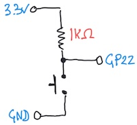

# Digital and Analog Inputs

*Material for a [UC Irvine](https://uci.edu/) course offered by the [Department of Physics Astronomy](https://www.physics.uci.edu/) and developed by [David Kirkby](https://faculty.sites.uci.edu/dkirkby/).*

In this activity, you will learn how to use the joystick as a physical input of both digital and analog information. You will first use the joystick to control and LED, then learn how to read the joystick's digital and analog state using the microcontroller.  This activity assumes you have already [setup your microcontroller](setup.md) and [built your first circuit](first-prog.md).

## An LED Circuit using USB Power

Build the circuit below using a Pico W microcontroller (not yet connected to your laptop via USB), a 1KΩ resistor, a red or green LED (your choice), your breadboard and some jumper wires:


The corresponding circuit diagram is:


The completed circuit should illuminate the LED. If it doesn't, check the polarity of your LED and trace the current path from 3.3V to GND through your breadboard, making sure that it matches the circuit diagram.

Although this circuit looks similar to your [first circuit](first-prog.md), here we are only connecting to the Pico W power (3.3V) and ground pins. This is a convenient way to power a breadboard circuit via your laptop's USB cable. Since there are no connections to any GPn or ADCn pins, there is nothing for a python program to do in this circuit, and any program already loaded in your Pico W will have no effect.

This is a good time to review the **Why the resistor?** note from your [first circuit writeup](first-prog.md).

Recall that a digital signal has only two states, which we can label HI / LO (or 1 / 0).  In this circuit, the electrical characteristics of these states are voltage levels of about 3.3V and 0V, and the LED acts as a digital output.

## Use a Joystick as a Digital Input

Experiment with the joystick in your kit to discover the three different ways you can iteract with it:
 - Press and release (which should both produce an audible click) to open and close a switch between the **GND** and **Sel** pins.
 - Push left and right to vary the resistances between the **GND** - **XOUT** and **XOUT** - **VCC** pins.
 - Push up and down to  vary the resistances between the **GND** - **YOUT** and **YOUT** - **VCC** pins.

Note that the **GND** and **VCC** joystick pin labels are slightly misleading since you are not *required* to connect these to the **GND** and **VCC** (3.3V) signals in your circuit, even though that is often a good idea.

Since the press / release action opens and closes a switch, there are only two states and this serves as a digital input. Connect two identical wires of the same color (but avoiding red and black since, by convention, these are reserved for power and ground) to the joystick's **GND** and **Sel** pins, then replace the black wire with the free ends of your joystick wires, as shown below:


Verify that when you press down on the joystick, the LED illuminates: you have now connected a digital input (switch) to a digital output (LED).

What do you think would happen if you replaced other wires in the original circuit with the switch?  Try it.

## Use a Joystick as an Analog Input

Next, we will use the left-right motion of the joystick as an analog signal to control the LED brightness. In this mode, each axis (X/Y) of the joystick serves as an independent [variable resistor or potentiometer ("pot")](https://learn.adafruit.com/make-it-change-potentiometers?view=all).  A potentiometer consists of two resistors R1 and R2 connected in series, within a single package, such that R1 + R2 = RTOT is fixed (at 10KΩ for the joystick).  The three pins of a potentiometer connect as shown below, and moving the joystick left/right or up/down (or rotating a rotary potentiometer) varies how RTOT is split between R1 and R2.  The pin between R1 and R2 for left/right joystick motion is labeled **XOUT**. There pin **YOUT** is between R1 and R2 for a separate potentiometer controlled by up/down joystick motion.


The circuit already has a 1KΩ resistor that controls the LED brightness.  To vary this smoothly (i.e. in an "analog" fashion), add the left/right potentiometer's R1 in series with the existing 1KΩ resistor. In other words, replace the jumper wire between the 1KΩ resistor and LED with two jumper wires connected to the joystick **GND** and **XOUT** pins, as shown below:


By moving the joystick left to right you can now smoothly vary the resistance RLED in series with the LED from 1KΩ to 11KΩ. Note how this varies the LED brightness, but why does it vary more to the left (brighter) than the right (fainter)? The answer is that the brightness depends on the current flowing through the LED, which is proportional to 1/RLED:


## Read a Digital Input with the Microcontroller

Build the circuit below using a Pico W microcontroller (not yet connected to your laptop via USB), a 1KΩ resistor, the joystick, your breadboard and some jumper wires:


The corresponding circuit diagram is:



Enter this program in the Mu editor to read the switch:
```python
import board
import digitalio

switch = digitalio.DigitalInOut(board.D2)
switch.direction = digitalio.Direction.INPUT

state = switch.value

while True:
    if switch.value != state:
        state = switch.value
        print('state is now', state)
```

## Read an Analog Input with the Microcontroller

## Exercise: Connect Digital Inputs and Outputs with the Microcontroller
