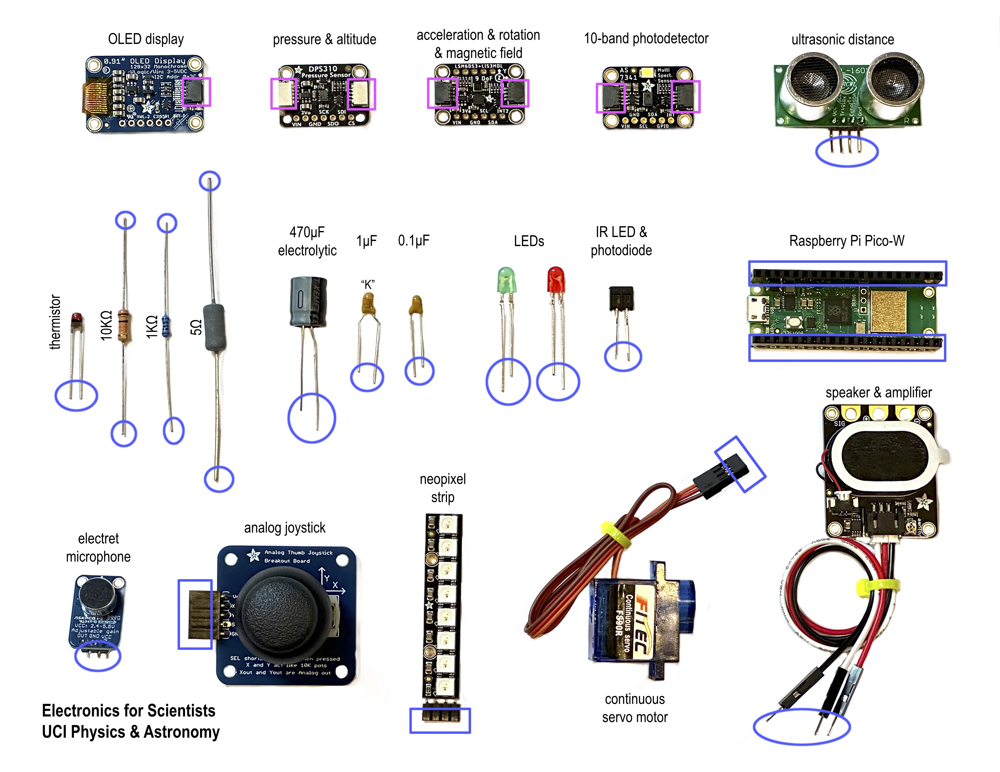
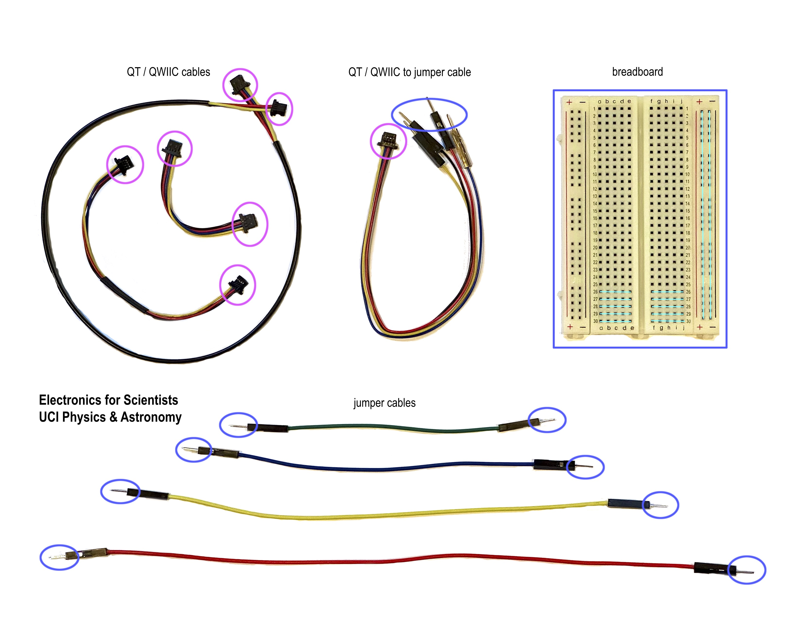

# E4S Kit

*Material for a [UC Irvine](https://uci.edu/) course offered by the [Department of Physics Astronomy](https://www.physics.uci.edu/) and developed by [David Kirkby](https://faculty.sites.uci.edu/dkirkby/).*

Welcome to your **Electronics for Scientists** kit!  Your kit should include a page of the images below, showing each component at full size (but you can also download the PDF [here](img/kit.pdf)):

To get started, place one of each component over its image. Most components are easily distinguised except for the 1μF and 0.1μF capacitors: look for a "K" marking on the 1μF capacitor. Note which ziploc bag each component is stored in so you can keep them organized when you put them away:
 - bag 1: passive linear components and optoelectronic components
 - bag 2: I2C modules
   - 2 x Pico W processors
   - sensors: pressure & altitude, acceleration & rotation & magnetic field; 10-band photodetector
   - OLED display
 - bag 3: miscellaneous
   - joystick, speaker, microphone, ultrasonic distance
- bag 4: jumper wires
- bag 5: QT/QWIIC cables for I2C communication

The blue and pink shapes show how to connect components: a round shape connects to a square of the same color. Blue are single-wire connections carrying a current at some voltage, and pink are communication links (using the [I2C bus](https://en.wikipedia.org/wiki/I%C2%B2C)) that carry digital packets of data using four wires.

Next, put away your components then turn the page over and place examples of the different wiring over their images. Note the blue and pink shapes again.  Although the breadboard does not look like wiring, it is a very convenient way to connect components once you [understand how it works](https://www.makeuseof.com/tag/what-is-breadboard/).

All of the circuits we will build with this kit use temporary wiring connections. For examples of permanent wiring, study the [printed circuit board (PCB)](https://en.wikipedia.org/wiki/Printed_circuit_board) used by your processor or sensor modules.  Can you identify the resistors, capacitors and LEDs on these PCBs?  They look very different from those in the kit because they use [surface-mount technology](https://en.wikipedia.org/wiki/Surface-mount_technology).

## Passive Linear Components

- 2 x 10KΩ resistors (0.5W)
- 2 x 1KΩ resistors (0.25W)
- 1 x 50Ω resistor (5W)
- 1 x [NTC thermistor](datasheets/thermistor.pdf) (1KΩ at 25°C)
- 1 x 470μF electrolytic capacitor (25V)
- 1 x 1μF capacitor (25V, looks similar to the 0.1μF but has a "K" marking)
- 1 x 0.1μF capacitor (50V, no "K" marking)

## Optoelectronic Components

- 1 x red LED
- 1 x green LED
- 4 x [IR LED + photodiode pair](datasheets/IRpair.pdf)

## Processor

- 2 x [Raspberry Pi Pico W](https://www.raspberrypi.com/documentation/microcontrollers/raspberry-pi-pico.html)

## Sensor Modules

- [pressure & altitude](https://www.adafruit.com/product/4494)
- [acceleration & rotation & magnetic field](https://www.adafruit.com/product/5543)
- [10-band photodetector](https://www.adafruit.com/product/4698)
- [ultrasonic distance](https://www.adafruit.com/product/4007)

## Miscellaneous

- [analog joystick](https://www.adafruit.com/product/512)
- [electret microphone with amplifier](https://www.adafruit.com/product/1063)
- [speaker with audio amplifier](https://www.adafruit.com/product/3885)
- [continuous servo motor](https://www.adafruit.com/product/2442)
- [128x32 OLED display](https://www.adafruit.com/product/4440)

## Wiring

- [breadboard](https://www.makeuseof.com/tag/what-is-breadboard/)
- jumper cables
- [QT](https://learn.adafruit.com/introducing-adafruit-stemma-qt/what-is-stemma-qt) / [QWIIC](https://www.sparkfun.com/qwiic) cables for digital communication cables with the [I2C bus](https://en.wikipedia.org/wiki/I%C2%B2C)
