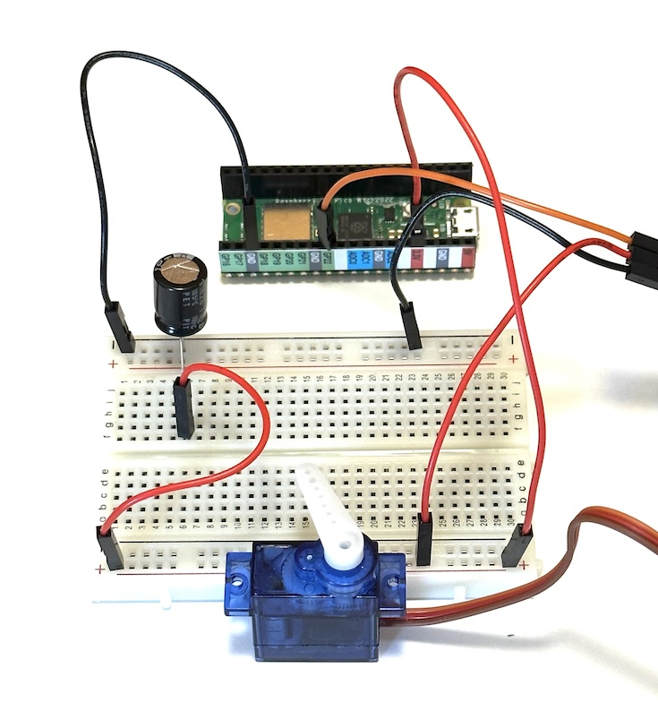
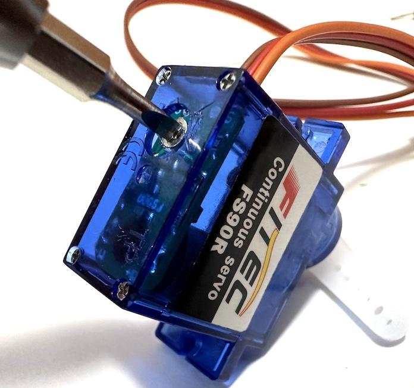

# Motors

*Material for a [UC Irvine](https://uci.edu/) course offered by the [Department of Physics Astronomy](https://www.physics.uci.edu/) and developed by [David Kirkby](https://faculty.sites.uci.edu/dkirkby/).*

## Introduction

A [motor](https://en.wikipedia.org/wiki/Electric_motor) is an electromechanical device that converts electrical energy into mechanical rotational energy. The heart of a motor is an electromagnet that allows a current flowing through a coil to control a magnetic field. Rotational motion is usually achieved via the magnetic torque between the current flowing through the coil and permanent magnets.  The inverse of a motor, to convert mechanical rotational energy to electrical energy, is a generator and operates on similar principles.

Motors can be powered by direct current (DC) or alternating current (AC). The more common DC motors usually have **brushes** that establish an alternating current path as the motor spins, but the more expensive **brushless** motors are mechanically simpler and more efficient.  DC **stepper** motors move in precise repeatable small steps, instead of continuously, and are common in (2D and 3D) printers and robotics.  Continuous (non-stepper) motors can also achieve precise angular positioning using an angle-measuring **rotary encoder** and a feedback loop. This configuration is known as a **servo** motor and usually includes hard stops for internal calibration that prevent rotations of more than 360 degrees.

The natural rotational speed of a motor is often much faster than desired for mechanical appplications, so gears are needed to reduce angular speeds while increasing torque. Note that gears are a mechanical analog of electrical transformers, which reduce voltage while increasing current (or vice versa).

Most motors consume more electrical power than a microcontroller (or USB bus) can supply. Therefore, some additional circuitry is needed to allow the microcontroller to control the flow of power from an external supply to the motor. A popular option is
an [H-bridge circuit](https://en.wikipedia.org/wiki/H-bridge) which also allows you to reverse the polarity of the voltage applied to the motor, so reverse its direction.

For a more-depth introduction to interfacing motors with microcontrollers, see [here](https://learn.adafruit.com/adafruit-motor-selection-guide?view=all) and [here](https://learn.sparkfun.com/tutorials/motors-and-selecting-the-right-one/all).

## Kit Motor

Your [kit](kit.md) contains a **Continuous Rotation Servo Motor**, but the [name is misleading](https://learn.adafruit.com/adafruit-motor-selection-guide?view=all#when-is-a-servo-not-a-servo-2875539) since can turn continuously, so is not limited to a 360 degree range, and has no rotary encoder or feedback.  This is a low power motor so can run directly from USB power, with the usual requirement of an external motor power supply.  If you look closely at this motor, you can see that it contains small gears and a circuit board with an H-bridge.

Add one of the plastic indicator dials to your motor (gently pressing it onto the output shaft) then build this circuit to drive your motor:



The purpose of the 470μF capacitor in this circuit is to isolate the microcontroller 3.3V power from sudden changes in the motor's power consumption: it is effectively acting as a small rechargable battery.  See [here](https://learn.adafruit.com/adafruit-arduino-lesson-14-servo-motors/if-the-servo-misbehaves) for more details.

**Double check that your electrolytic capacitor has its negative wire connected to GND before applying USB power.**

The motor has three connections:
 - Orange: power supply ground
 - Red: power supply voltage
 - Orange: control signal input

Note that the servo motor uses a brown wire for its GND connection, instead of the usual black.

The control signal expects digital pulses and uses the length of each positive pulse to determine the motor speed and direction. The nominal response is:
 - 0.7ms pulse width: maximum-speed clockwise (CW) rotation
 - 1.5ms pulse width: no rotation
 - 2.3ms pulse width: maximum-speed counter-clockwise (CCW) rotation

The behavior is undefined for pulses shorter than 0.7ms or longer than 2.3ms but, typically, values slightly outside this range will give maximum rotation and values further outside this range will give no rotation.

We can use a [pulse-width modulation (PWM) output](aout.md) to conveniently keep the motor turning while slowly varying its speed via changes to `PWM.duty_cycle`.  Test your motor using a constant PWM frequency of 50 Hertz with this program:
```python
import time
import board
import pwmio

FREQUENCY = 50 # Hertz
PERIOD_MS = 1000 / FREQUENCY

PWM = pwmio.PWMOut(board.GP22, frequency=FREQUENCY)

moves = [
    dict(pulse=0.0, description='No rotation?'),
    dict(pulse=0.7, description='Fast CW'),
    dict(pulse=1.4, description='Slow CW'),
    dict(pulse=1.5, description='No rotation'),
    dict(pulse=1.6, description='Slow CCW'),
    dict(pulse=2.3, description='Fast CCW'),
    dict(pulse=5.0, description='No rotation?'),
]

while True:
    for move in moves:
        PWM.duty_cycle = int(0xffff * (move["pulse"] / PERIOD_MS))
        print(f'pulse duration={move["pulse"]:.1f}ms => {move["description"]}')
        time.sleep(2)
```
Compare your motor's actual motion with the descriptions printed by the code to the Serial window.  How well do they match?

If your motor is not moving during the *Slow CW* or *Slow CCW* phases, or moves at noticably different speeds (in opposite directions), then its pulse detection circuitry is not well calibrated.  In this case, one option is to measure the true center pulse width between CW and CCW rotation and use that in your code.  Alternatively, there is a small potentiometer on the internal circuit board, right below the output shaft, that you can turn to adjust the pulse-width calibration.  You will need a small slotted screwdriver for this.  Modify the program for a constant 1.5ms pulse width, then adjust the potentiometer to find the center between CW and CCW rotation. You will probably only need to adjust by a small fraction of a turn.



## Exercise: Second Hand

Modify your code so that the plastic indicator on the motor serves as a reasonable second hand.

## Exercise: Remote Control

Add the joystick to your circuit with one of its potentiometers connected as a voltage divider so you can read either Xout or Yout with a microcontroller [analog input](inputs.md).  Write a program that allows the joystick to control the motor speed and direction, with no rotation when the joystick is in its center position.
