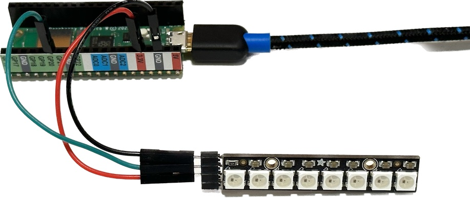

# Neopixels

*Material for a [UC Irvine](https://uci.edu/) course offered by the [Department of Physics Astronomy](https://www.physics.uci.edu/) and developed by [David Kirkby](https://faculty.sites.uci.edu/dkirkby/).*

## Introduction

Neopixels are devices that contain separate red, green and blue LEDs that can be individually controlled.  Each neopixel has some simple on-board processing to enable all three LEDs to be controlled via a single digital output.  Even better, multiple neopixels can be chained together using a single digital output for control since each pixel knows its position in the chain and will pass on any instructions meant for a later pixel.

A neopixel is an example of what is known generically as an **RGB LED**. Our neopixels are based on the [WS2812 device](https://cdn-shop.adafruit.com/datasheets/WS2812.pdf).  Some microcontrollers have a single neopixel included but the Pico does not.  Instead, your kit contains a strip of 8 neopixels that we will use.

Build the following circuit to get started:



Note that we are connected the Pico **3.3V** pin to **5VDC** on the strip: this is not a mistake and is necessary for this circuit since this voltage determines the logic levels used to communicate with the neopixels.

Here is some code to implement a "marching LED" for testing:
```python
import time
import board
import neopixel

# Initialize communication with the neopixel strip using a single digital output.
NLEDS = 8
leds = neopixel.NeoPixel(board.GP20, NLEDS, auto_write=False)
leds.brightness = 0.02

# Define the LED states to use as (R,G,B) each in the range 0-255.
OFF = (0, 0, 0)
ON = (255, 0, 0)

while True:
    # Cycle through LEDs to turn on, one at a time.
    for i in range(NLEDS):
        for j in range(NLEDS):
            leds[j] = ON if i == j else OFF
        # Changes to led[] do not take effect until led.show()
        leds.show()
        time.sleep(1)
```

Read through the comments for hints on controlling neopixels. Note that we use a [library](https://docs.circuitpython.org/projects/neopixel/en/latest/index.html) to handle the communications with the chain of pixels.

Using `auto_write=False` in the initialization means that changes to the LEDs do not take effect until `led.show()` is called.  Try commenting this out to see what happens.  Next, try `auto_write=True` with `led.show()` still commented out.  In this simple example, `auto_write=False` and `led.show()` are not really necessary, but they do improve performance when many neopixels turned on or off at once.

The example above uses a relatively low brightness of 0.02.  The reason for this is that turning on all 8 LEDs at maximum brightness (1.0) would require 480mA to be supplied.  However, the Pico W [datasheet](https://datasheets.raspberrypi.com/picow/pico-w-datasheet.pdf) recommends not exceeding 300mA.  What might happen if you exceed this?  You probably would not do any permanent damage, but would cause the USB power to drop sufficiently that the Pico would reset and stop running its program.  Your laptop operating system might also complain about excessive current draw on its USB port.

If you turn over your neopixel strip, you will notice copper pads labeled **GND**, **DOUT** and **5VDC**.  If you were to connect these to **GND**, **DIN** and **5VDC** of a second strip (e.g. using soldered jumper wires), you could then set `NLEDS = 16` in your code and control both strips at once.

## Exercise 1

Look up the R,G,B values (0-255) of your favorite color [here](https://www.rapidtables.com/web/color/RGB_Color.html) and use them for the `ON` state.  Can you see the individual red, green and blue LEDs in the device?  How well does the LED mixture match the color you expected?

## Exercise 2

Connect your joystick to an analog input and use it to control which of the 8 neopixels is illuminated, using a scheme of your design.