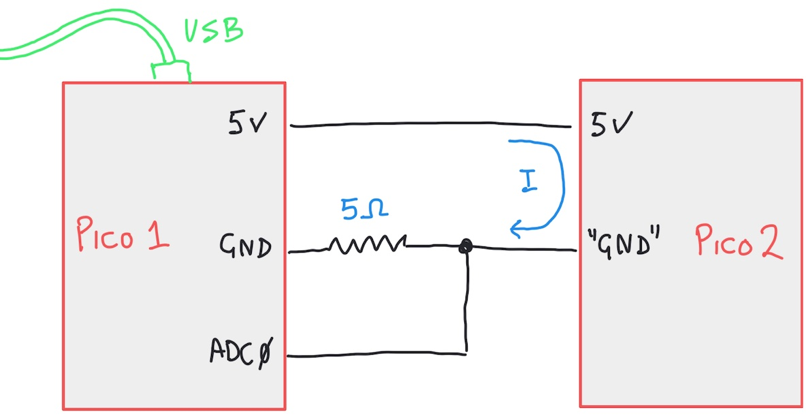

# Power Measurement and Design Considerations

*Material for a [UC Irvine](https://uci.edu/) course offered by the [Department of Physics Astronomy](https://www.physics.uci.edu/) and developed by [David Kirkby](https://faculty.sites.uci.edu/dkirkby/).*

## Introduction

Power is the rate of doing work, usually measured in Watts with 1 W equal to 1 Joule of work per second. In an electrical circuit, a current I flowing across a voltage drop V has a corresponding power of P = V I (and a Volt-Amp equals a Watt).  If your circuit consists of a single resistance R across the voltage drop V, the corresponding current is I = V / R and the resulting power is P = V^2 / R.  More useful is the fact that any circuit has a corresponding (instantaneous) equivalent resistance (aka impedance) that can be plugged into this formula.

**Exercise:** Calculate the power consumption for a circuit powered by USB with equivalent resistanceσ of 1Ω, 1KΩ and 1MΩ.

## Current Measurements

All of our circuits in this class are powered by a USB port, which supplies 5V so the total voltage drop across any circuit is 5V. In order to know the power consumption of a circuit, we need to measure the current drawn from the USB port.  Most USB ports will supply a maximum of 0.5A, corresponding to 2.5W of maximum power.

**Exercise:** Calculate the equivalent resistance that draws 0.5A for a USB-powered circuit.

A simple way to measure the USB current draw is to place a resistor in series with the 5V supply and measure the voltage drop across it. This resistor should have a small resistance, in order to not change the 5V supply too much, and must be able to dissipate at least 2.5W. Your [kit](kit.md) contains a 5Ω resistor rated up to 5W for just this purpose.  Here is the circuit we will use to measure the power consumption of one Pico using a second Pico:



Notice how we add the series resistor on the ground side of the power supply, not the 5V side.  This works because the current is the same at any point along a current loop.  It is more convenient because it means our ADC can measure the relevant voltage drop relative to ground (0V), instead of 5V (where a small voltage drop would exceed the 3.3V maximum ADC input).

Load the following program into the first Pico to measure and display the current draw and power consumption of the second Pico:
```python
import time

import board
import analogio

adc = analogio.AnalogIn(board.A0)

NAVG = 32
RDROP = 5.0
VUSB = 5.0

while True:
    time.sleep(1)
    # Sample the ADC NAVG times.
    samples = [adc.value for i in range(NAVG)]
    # Calculate the average ADC value in ADU
    adu = 0
    for i in range(NAVG):
        adu += samples[i]
    adu /= NAVG
    # Convert from ADU to voltage drop (in Volts) across the 5Ohm resistor.
    vdrop = adu * 3.3 / 0xffff
    # Calculate the corresponding current drawn (in Amps) by the second Pico.
    idraw = vdrop / RDROP
    # Calculate the power consumed by the second Pico.
    power = (VUSB - vdrop) * idraw
    print(f'Second pico draws {1e3*idraw:.1f}mA and consumes {power:.2f}W')
```

What is the power consumption of your second Pico when you run this program?  Verify that it drops (close) to zero if you disconnect the power to the second Pico.

**Activity:** Modify this program to display a graph of power consumption that updates every 0.1 seconds. Remove power from both Picos, then connect the pressure sensor module to the second Pico and load the [code we used earlier](https://dkirkby.github.io/E4S/i2c.html#pressure-sensor) to read it out. Be sure to load this code in the second Pico, keeping the code above in the first Pico. After programming the second Pico, move the USB cable back to the first Pico. Does the graph of power consumption show periodic variations with the 1-second pressure and temperature sensor readouts?

## Stored Energy

It is sometimes convenient (or necessary) to run a circuit without any direct wired connection to a power supply (USB or otherwise). In this case, your circuit is running off a stored energy source which is typically a battery.  Stored energy (like any energy) can be measured in Joules, but it can be more convenient to express it units like Watt-hours: a 1 W-h battery can provide 1 Watt for 1 hour or 2 Watts for half an hour or 0.5 Watts for 2 hours, etc.  Since a battery supplies a fixed voltage, we can divide the stored energy by this voltage to express the stored energy in Amp-hours.

**Exercise:** Calculate the conversion from 1 Amp-hour to Joules assuming a battery voltage V.

**Exercise:** Look up the typical stored energy in Amp-hours for each of the following batteries. Convert each value to Joules.
- AA battery
- iphone 14 battery
- gasoline car battery
- Tesla model 3 battery

**Exercise:** Calculate the stored energy in Joules of a 1kg bag of sugar raised 1m off the floor. How does this compare with the batteries above?

**Exercise:** Look up the stored energy in Joules of a gallon of gasoline. How does this compare with the batteries above?

**Exercise:** Calculate the cost ($) of 1 MegaJoule of stored energy in the form of AA batteries or gasoline.  Which is more cost effective?

A rechargeable battery allows you to periodically add stored energy, but requires some additional components. Browse batteries that can be used to power a Pico circuit [here](https://www.adafruit.com/category/917).  To charge these, you would need [one of these](https://www.adafruit.com/category/575).

**Exercise:** Suppose you have chosen a 3.7V 400mAh rechargeable battery and your project consumes 0.5W of power. Calculate how long you can run on a single charge.

## Low-Power Strategies

Most microcontrollers, including the Pico W, support different power states. To access these from MicroPython, use the [alarm library](https://docs.circuitpython.org/en/latest/shared-bindings/alarm/index.html).  The power control modes of the RP2040 microcontroller used in the Pico W are documented in section 2.11 on p.163 of the [datasheet](https://datasheets.raspberrypi.com/rp2040/rp2040-datasheet.pdf).

Here is a simple example that puts the Pico into a lower-power sleep mode after initial power up, then wakes every 5 seconds or whenever a wire connected to GP22 is momentarily connected to ground:
```python
import time

import board
import alarm
import digitalio

# Why did we wake up?
wake_trigger = alarm.wake_alarm
if wake_trigger is None:
    # Initial boot, before any deep sleep
    nblink = 5
elif isinstance(wake_trigger, alarm.time.TimeAlarm):
    # Woke up after a TimeAlarm
    nblink = 1
elif isinstance(wake_trigger, alarm.pin.PinAlarm):
    # Woke up after a PinAlarm
    nblink = 2

# Blink an external LED to indicate why we woke up.
led = digitalio.DigitalInOut(board.GP21)
led.direction = digitalio.Direction.OUTPUT
blink_time = 0.1 # seconds
for i in range(nblink):
    led.value = True
    time.sleep(blink_time)
    led.value = False
    time.sleep(blink_time)

# Return to deep sleep mode, waiting for the next wake trigger.
alarm_duration = 5 # seconds
time_alarm = alarm.time.TimeAlarm(monotonic_time=time.monotonic() + alarm_duration)
switch_alarm = alarm.pin.PinAlarm(pin=board.GP22, value=False, pull=True)
alarm.exit_and_deep_sleep_until_alarms(time_alarm, switch_alarm)
```

Since having a USB port and Serial connection open prevents using the low-power sleep mode, we want this circuit to run from power bridged from another Pico using jumper wires, i.e. it acts as the second Pico in our measurement setup above.  With no Serial output, we use an LED (installed on the breadboard with a 1K series resistor) driven by GP21 to signal when and why the Pico wakes up each time.

**Exercise:** Install the program above on the second Pico and verify (using the first Pico) that its power consumption is lower than you measured earlier.

## Alternative Power Sources

You can also power your project using renewable energy sources such as solar and wind. However, since these are quite variable and unpredictable, most practical designs also require a battery and additional components. Browse solar panels suitable for using with a Pico circuit [here](https://www.adafruit.com/category/580).  Note that the current values quoted for a solar panel are generally maximum values that are only achievable when the full sun is directly overhead.
