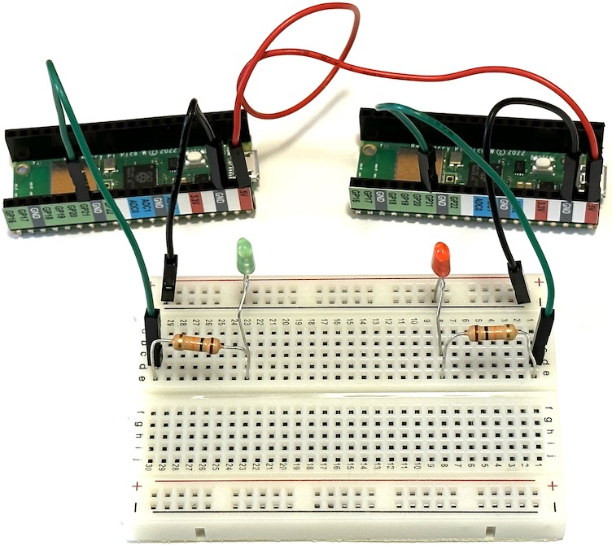
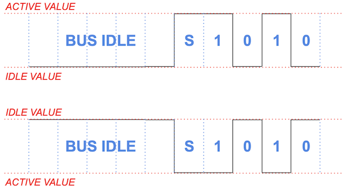

# Project: Communication between Circuits

In this project you will explore how two circuits can communicate. You will first implement a simple protocol for sending a small number of binary values and debug it at low speeds using a direct electrical connection.  Next, you will speed up the communication 100 times and implement a higher-level layer for sending text messages.  Finally, you will replace the direct electrical connection with a wireless infrared connection and implement bidirectional communication.

## Build the Transmitter

In this project, you will use both of the pico W modules: one to transmit and one to receive.  Only one Pico can be connected to the Mu editor at once, with convenient debugging with print statements, and the other will be powered and running independently from the first Pico's USB cable via some jumper wires.

Build the following circuit using both Pico modules:



Connect one Pico to the Mu editor and set it up to transmit using the following program:
```python
import time
import array
import board
import digitalio

# Define the transmitter idle state during a period with no communication.
TX_IDLE_VALUE = False

# Define the duration of a single bit in seconds.
BIT_DURATION = 0.5
HALF_BIT_DURATION = BIT_DURATION / 2

# Define the length of a message in bits.
MSG_BITS = 4

# Minimum number of idle bits before a start bit.
MIN_IDLE_BITS = MSG_BITS + 1

# Configure the transmit digital output.
TX = digitalio.DigitalInOut(board.GP22)
TX.direction = digitalio.Direction.OUTPUT

# Configure the transmit indicator LED.
LED = digitalio.DigitalInOut(board.GP21)
LED.direction = digitalio.Direction.OUTPUT

# Start in the IDLE state.
TX.value = LED.value = TX_IDLE_VALUE

def transmit(msg):
    assert len(msg) == MSG_BITS
    # Add the minimum number of idle bits then a start bit.
    prologue = [TX_IDLE_VALUE] * MIN_IDLE_BITS + [not TX_IDLE_VALUE]
    data = [TX_IDLE_VALUE if not bit else not TX_IDLE_VALUE for bit in msg]
    # Allocate and fill an efficient array of the bits to transmit.
    bits_array = array.array('B', prologue + data)
    print('Start message')
    for k, bit in enumerate(bits_array):
        TX.value = LED.value = bit
        print(f'bit[{k}] = {bit}')
        time.sleep(BIT_DURATION)
    # Leave the bus in the idle state.
    TX.value = TX_IDLE_VALUE

while True:
    transmit([1,0,1,0])
```
Note how we use a dedicated digital output (GP21) to drive an indicator LED that mirrors the state of the transmit (TX) line.

Although this is a simple communication protcol, there are still a few things we need to specify:
 - What is the state of the "bus" (communication channel) when there is no activity?
 - What is the duration of each bit?
 - How many bits are sent together as a single message?
 - How is each message "framed", i.e. how can a receiver identify the start of a new message?

Study the code above carefully and make a note of your answers to each question.  We use the [array library](https://docs.python.org/3/library/array.html) instead of the more general purpose python lists in the `transmit` function to provide faster and more reproducible timing. Notice how the
code specifies voltage levels at a logical level, as either `False` (0V) or `True` (3.3V).

The timing diagrams below show graphs of voltage versus time for a single 4-bit message transmitted with `TX_IDLE_VALUE=False` (top) or `TX_IDLE_VALUE=True` (bottom):



The "S" label identfies a **start bit**, which is frequently used to implement [asynchronous protocols](https://en.wikipedia.org/wiki/Asynchronous_serial_communication). The sequence of bits being transmitted here correspond to this statement in your main loop:
```
    transmit([1,0,1,0])
```
Notice that we require the bus to be idle for `MSG_BITS+1` bit durations before each message, which effectively imposes at least 50% deadtime on this protocol.  What might go wrong without this long idle-time requirement?  Modern protocols avoid this using techniques such as [bit stuffing](https://en.wikipedia.org/wiki/Bit_stuffing).

Open the Mu Serial window and compare the output with the indicator LED flashes. Make sure you understand why the code produces the sequence of flashes you observe before proceeding to the next step of this project.

To complete this section, untether your transmitter and power the receiver with the following steps:
 - Eject the CIRCUITPY usb drive from your computer.
 - Close the Serial window in the Mu editor (if it was open).
 - Disconnect the USB cable from the transmitter Pico.
 - Plug the USB cable into your second Pico, which will be our receiver.

You should now see the transmitter LED flashing the same sequence as before, since it is receiving USB power (5V, GND) from the receiver Pico's USB connection via jumper wires.

## Build the Receiver

Instead of writing a separate receiver program, we will add receiving capability to the transmitter program and re-use the same protocol specification.

Load this program into your receiver Pico:
```python
import time
import array
import board
import digitalio

# Define the transmitter and receiver idle states during a period with no communication.
TX_IDLE_VALUE = False
RX_IDLE_VALUE = False

# Define the duration of a single bit in seconds.
BIT_DURATION = 0.5
HALF_BIT_DURATION = BIT_DURATION / 2

# Define the length of a message in bits.
MSG_BITS = 4

# Minimum number of idle bits before a start bit.
MIN_IDLE_BITS = MSG_BITS + 1

# Configure the receive digital input.
RX = digitalio.DigitalInOut(board.GP20)
RX.direction = digitalio.Direction.INPUT
RX.pull = digitalio.Pull.UP if RX_IDLE_VALUE else digitalio.Pull.DOWN # Idle when disconnected

# Configure the transmit digital output.
TX = digitalio.DigitalInOut(board.GP22)
TX.direction = digitalio.Direction.OUTPUT

# Configure the transmit indicator LED.
LED = digitalio.DigitalInOut(board.GP21)
LED.direction = digitalio.Direction.OUTPUT

def transmit(msg):
    assert len(msg) == MSG_BITS
    # Add the minimum number of idle bits then a start bit.
    prologue = [TX_IDLE_VALUE] * MIN_IDLE_BITS + [not TX_IDLE_VALUE]
    data = [TX_IDLE_VALUE if not bit else not TX_IDLE_VALUE for bit in msg]
    # Allocate and fill an efficient array of the bits to transmit.
    bits_array = array.array('B', prologue + data)
    print('Start message')
    for k, bit in enumerate(bits_array):
        TX.value = LED.value = bit
        print(f'bit[{k}] = {bit}')
        time.sleep(BIT_DURATION)
    # Leave the bus in the idle state.
    TX.value = TX_IDLE_VALUE

while True:
    LED.value = RX.value
```
Carefully review the differences from the transmitter program above. Some things to note are:
 - The `transmit` function is no longer being used.
 - We define the receiver's idle state independently of the transmitter's. The reason for this will become apparent later.
 - The main (infinite) loop mirrors the received level (True/False) directly on the green LED.

At this point, the red TX LED should be flashing as before, but the green RX LED is always off. Next, make the electrical connection that constitutes our communications "bus": add a jumper wire between the Pico GP22 pins (TX to RX).  Note that any communication using voltage levels requires at least two wires, but the second wire in this case is the GND connection via the breadboard.  Now the green RX LED should be exactly following the red TX LED.

Next, enter the following skeleton receive function below the transmit function:
```python
def receive():
    # Allocate an efficient array of the received bits.
    bits_array = array.array('B', [0] * MSG_BITS)
    # Loop until we find a valid start bit.
    while True:
        # Wait for the bus level to be RX_IDLE_VALUE (if it isn't already)
        # ...
        print('idle start')
        # Keep checking for RX_IDLE_VALUE for the minimum idle period.
        wait_until = time.monotonic() + MIN_IDLE_BITS * BIT_DURATION
        # ...
        print('min idle completed')
        # Wait for a start bit.
        # ...
        print('got start bit')
        break
    # Delay for half a bit.
    time.sleep(HALF_BIT_DURATION)
    # Sample each bit at its nominal center time.
    for i in range(MSG_BITS):
        time.sleep(BIT_DURATION)
        LED.value = bits_array[i] = (RX.value != RX_IDLE_VALUE)
        print(bits_array[i])
    return bits_array
```
We control the timing of our code using the [sleep](https://circuitpython.readthedocs.io/en/latest/shared-bindings/time/#time.sleep) and [monotonic](https://circuitpython.readthedocs.io/en/latest/shared-bindings/time/#time.monotonic) functions.  The sleep function is easier to use but does not allow us to do anything else while we wait the requested amount of time.  The monotonic function operates at a lower level, just reporting the current time (as elapsed seconds since an arbitrary zero), but allows us to implement an active delay, where we do something useful while waiting (such as checking a logic level). Here is a simple standalone example of using monotonic to wait 5 seconds while printing periodic update messages (you do not need to add this to your program):
```python
import time

now = time.monotonic()
wait_until = now + 5

while now < wait_until:
    now = time.monotonic()
    print('now', now, 'remaining', wait_until - now)
    time.sleep(1)
```
Since the monotonic time is represented as a floating-point number, you should never test for `now == wait_until` since that is very unlikely to be exactly true.  Instead, always use an inequality test, as in the example above.

Next, change your main (infinite) program to:
```python
while True:
    # Uncomment the first line in the transmitter or the second in the receiver.
    #transmit([1,0,1,0])
    print(receive())
```
When you run this code, you should see repeated output in the Mu Serial window similar to:
```
idle start
min idle completed
got start bit
1
1
0
1
array('B', [1, 1, 0, 1])
```
However, the received values (1,1,0,1 in this example) will be constantly changing, instead of showing the actual transmitted values of (1,0,1,0).  Try disconnecting the communictions jumper wire between the transmitter GP21 and receiver GP20: the received values should now always be (0,0,0,0) which indicates that at least the bus is doing something.

In order to get your reciever working correctly, you will need to fill in the three `...` sections in the code, following the instructions in the comments.  Think about why the code sleeps for a `HALF_BIT_DURATION` before sampling each bit of the message. When your receiver code is working, you should see the following repeated sequence of print output in the Mu Serial window:
```
idle start
min idle completed
got start bit
1
0
1
0
array('B', [1, 0, 1, 0])
```
The green RX LED will also indicate the received data bits (but not the start bit), with a half-bit (0.25s) delay.

## Warp Speed

The protocol configuration we used above is deliberately very slow to allow individual bits to be traced with the red LED and print output.

Now, speed up your code 100 times by setting:
```
BIT_DURATION = 0.005
```
Also, double the message size, to a "byte" or 8 bits, since this is convenient for later adding higher-level protocol layers:
```
MSG_BITS = 8
```
Finally, remove (or comment out) the `print` calls in your `receive` function (since they would
slow us down now) and update the main loop:
```python
while True:
    # Uncomment the first line in the transmitter or the second in the receiver.
    transmit([1,0,1,0,0,1,1,0]); time.sleep(1)
    #print(receive())
```

After you download this code, your slow receiver is now a fast transmitter. Note the different
sequence of red LED flashes.  Although this protocol transmits each message 100 times faster, we added a one second delay between messages in the main loop so you can distinguish the individual messages.

Repeat the untethering steps above to power your fast transmitter from the 9VDC supply. Connect the second M4 (the original slow transmitter) to usb and download the same program with the following small change required to make it a fast receiver:
```python
while True:
    # Uncomment the first line in the transmitter or the second in the receiver.
    #transmit([1,0,1,0,0,1,1,0]); time.sleep(1)
    print(receive())
```
Since you are swapping the transmitter and receiver roles, you will also need to rewire the jumper wire connecting TX to RX (by swapping D0 and D1 at each M4).

You should now see this print output repeated in the Mu editor serial window:
```
array('B', [1, 0, 1, 0, 0, 1, 1, 0])
```
In case you don't see this, close and re-open the serial window then double check your code and connections.  If the high speed protocol is still not working, you may have discovered a flaw
in your receiver code that only affects high-speed operation.  To test this theory, try
different speeds by changing `BIT_DURATION`.  Remember that you need to update both the receiver and transmitter whenever you make a change to the protocol parameters.

## Another Layer

We have now established a communication protocol that operates at 200 bits per second (bps or "baud"). This is still extremely slow by modern standards: for example, USB 3 can communicate at 5 Gbps! However, 300 baud was the standard speed for connecting to the early internet (via [dial-up modems](https://en.wikipedia.org/wiki/Dial-up_Internet_access)) and we are already communicating fast enough to benefit from a higher layer of abstraction.

Most communication protocols are organized into [stacks](https://en.wikipedia.org/wiki/Protocol_stack) of progressively more abstract layers, each one building on the one below it.  For example, a USB keyboard uses a [human-interface device](https://en.wikipedia.org/wiki/USB_human_interface_device_class) protocol layered above a lower-level bit oriented electrical protocol.  Similarly, the web sends HTTP messages, defined in a protocol above a tall stack of lower-level networking protocols.

We will now implement a layer to exchange text messages that builds on top of our existing "high-speed" bit protocol.  Starting with the sending side, we can send each character like this:
```python
def send_text(text):
    """Send each character of the text then 8 zeros.
    """
    for char in text:
        transmit(char_to_bits(char))
    # Transmit 8 zeros to signal that we are done.
    transmit([0] * 8)
```
Note that we need some way to indicate when a message is complete.  We accomplish this by sending
a sequence of 8 zeros, which is not a valid character. (Many programming languages use this same convention to indicate where a string ends in memory.)

This `send_text` function relies on a `char_to_bits` function that you will need to complete:
```python
def char_to_bits(char, nbits=8):
    """Encode a single character as a sequence of nbit binary values
    representing its numeric code, starting with the least-significant bit.
    """
    value = ord(char)
    return ...
```
Since this function makes no use of any special M4 features, you can test it in any python environment on your computer, if that is more convenient.  Note the use of the [ord function](https://docs.python.org/3/library/functions.html#ord) to convert any character to a corresponding integer value in the range 0-255 (for standard ASCII characters).

Test your `char_to_bits` by checking that `A` returns `[1, 0, 0, 0, 0, 0, 1, 0]` and `z` returns `[0, 1, 0, 1, 1, 1, 1, 0]`.  If your arrays are backwards, you have implemented most-significant bit (MSB) ordering instead of the desired LSB ordering.

Next, implement the receiving end of this text message protocol with:
```python
def get_text():
    """Get characters until we see 8 zeros.
    """
    text = ''
    while len(text) < 128:
        bits = receive()
        if any(bits):
            text += bits_to_char(bits)
        else:
            # Got 8 zeros so we are done.
            return text
```
You will need to implement the `bits_to_char` function to make this work but, again, you can develop and test it in any python environment.  The [chr function](https://docs.python.org/3/library/functions.html#chr) should help. A useful way to test pairs of functions like these is to perform a round trip, e.g.
```python
print(bits_to_char(char_to_bits('A')))
```
If the result is not `A`, then something is wrong...

Finally, update your main loop:
```python
while True:
    # Uncomment the first line in the transmitter or the second in the receiver.
    send_text('Hello, world!'); time.sleep(1)
    #print(get_text())
```
and install this new code in both your transmitter and receiver (remembering to modify the main loop in the receiver).  You should now see `Hello, world!` printed in your receiver's serial window every second.

If you are new to python programming, or a bit rusty, you might find writing these two functions to be harder than I intended, but don't hesitate to ask for help.

## Wireless

Although the term "wireless" usually implies communication via electromagnetic waves with wavelengths measured in centimeters (microwaves), this is just one of many non-electrical channels available. We will use infrared radiation with a wavelength of about 1 micron, but you could also use sound waves, etc.

To establish our wireless "bus", we will point a pair of IR transmit-receive pairs at each other on the breadboard:


Note that there is no longer any direct electrical connection between the M4s (not even a common ground voltage).  The transmitter's TX now drives the IR LED of one pair (through a 1K series resistor) and the receiver's RX listens to the IR phototransistor of the other pair (using an internal pull-up resistor).

Before building this circuit, you will need to carefully bend the leads of each IR pair following these steps:


You will need scissors or nail clippers (or small wire cutters if you have them) to clip the two longer leads in the final step.

Here is a closeup of one IR pair inserted into the breadboard, with green labels identifying which rows of the breadboard are connected to the GND, RX and TX of the IR pair, and green arrows showing the locations of the IR sensor and emitter:


Make sure that all 4 leads of the IR package are inserted far enough into the breadboard to make electrical contact.  Also double check that you are using the 1K series resistor from your kit, and not the (almost indistinguishable) 10K resistor.

Going wireless does not require any changes to your transmitter code, but there is a simple change required for the receiver:
```
RX_IDLE_VALUE = True
```
Why is this change required?  Check that your wireless setup now gives the same results as your previous wired setup.

Verify that blocking the light path between the IR pairs suspends the communication (but note that you will need a lot more than a sheet of paper to block this relatively bright emitter).

## RSVP

All of our communication so far has been in one direction.  In this final section, you will implement bidirectional communication.  Since we have implemented the transmit and receive functions in a single program, the only firmware change needed to accomplish this is a new main loop:
```python
msg = 'Hello, world!'

while True:
    # Uncomment the first line in the untethered M4 or the second in the M4 connected via usb.
    send_text(get_text().upper())
    #print('>>', msg); send_text(msg); print('<<', get_text()); time.sleep(0.5)
```
Note that we can no longer refer to one M4 as the transmitter and the other as the receiver, but they still play different roles with this main loop: what do you predict will happen when this main loop is running in both M4s?

In addition to updating the main loop, you will need to add another 1K resistor and two jumper wires
to establish the second communications channel in the opposite direction.  A good choice of jumper wire colors can make it easier to visually check your circuit.

Bidirectional communication is also known as [duplex](https://en.wikipedia.org/wiki/Duplex_(telecommunications)), which comes in two flavors: **full-duplex**, where communication is possible simultaneously in both directions, or **half-duplex**, where both sides must take turns.  Explain why our implementation is half-duplex and how it could be easily upgraded to full-duplex.

The untethered M4 now waits for a message, processes it, then returns the result.  In this example, the processing is simply to [convert to upper case](https://docs.python.org/3/library/stdtypes.html#str.upper), leading to this repeated output in the Mu editor serial window:
```
>> Hello, world!
<< HELLO, WORLD!
```
Although we have two M4s talking to each other, the untethered M4 could instead forward its processed message to a third M4.  You could then use this "pass-through" architecture to implement hardware compression or encryption.
