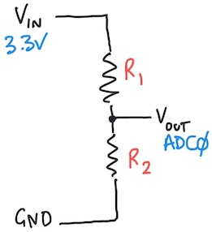

# Project: Digital Multimeter

*Material for a [UC Irvine](https://uci.edu/) course offered by the [Department of Physics Astronomy](https://www.physics.uci.edu/) and developed by [David Kirkby](https://faculty.sites.uci.edu/dkirkby/).*

In this project, you will use your microcontroller to create a simple [digital multimeter](https://en.wikipedia.org/wiki/Multimeter) (DMM), taking advantage of its internal [analog-to-digital converter (ADC)](https://en.wikipedia.org/wiki/Analog-to-digital_converter) circuitry.

You have probably already used a dedicated multimeter, either as a handheld device like this:


or a more expensive and accurate benchtop instrument like this:


A multimeter can measure many properties of an analog signal or simple component but the most commonly needed measurement is of a constant voltage level, often referred to as DC or *direct current*, so that is what we will start here.

## Analog Voltage Measurement

Start by connecting a long black jumper wire to any of the Pico GND pins (GND stands for **ground** and represents the 0V reference) and a long yellow jumper wire to the Pico ADC input labeled **ADC0** (there are also inputs labeled **ADC1** and **ADC2**).  Refer to the [pinout diagram](../Pico.md) for help finding these pins.

You can read the voltage on pin ADC0 using:
```python
import time
import board
import analogio

ADC0 = analogio.AnalogIn(board.A0)

while True:
    ADU = ADC0.value
    print(f'ADU = {ADU:5d} (dec) = ${ADU:04x} (hex)')
    time.sleep(0.5)
```
Enter this program into your editor and run it to display the resulting values in the "Serial" tab.  If you are not familiar with [hexadecimal (hex) notation](https://www.youtube.com/watch?v=4EJay-6Bioo), take a moment to review it now.  If you are using linux and get an error about accessing the serial port device, you will need to update your permissions[^linuxperms].

[^linuxperms]:
    On ubuntu and debian, this command should give your user account access to the serial port:
    ```
    sudo adduser $USER dialout
    ```
    Other flavors of linux may require something different.

With the black and yellow wires floating (i.e. not connected to anything at their other end), the displayed values will likely be fluctuating since the ADC0 pin does not have a low-impedance path to any established voltage level.

## Conversion to Volts

The printed values are in "analog-to-digital units" (ADU) so we still need to convert them to physical units.
To do this, plug the free end of the yellow wire into a second GND pin on the microcontroller, so we know the ADC0 voltage is 0V (relative to the black wire).  Record the typical (decimal) value you observe.  Note that we can leave the black wire floating since it already uses the same 0V (GND) reference as the voltage source we are measuring (which is itself!)

Next, connect the yellow wire to 3.3V and record the typical (decimal) value you observe.  Now write down a formula to convert from ADUs to Volts, assuming a linear relationship.  Modify your code to print this value.

Predict what ADU value you expect with a 5.0V input.  Go ahead and try this by connected the yellow wire to the microcontroller 5V pin (which comes directly from your laptop via the USB cable) and compare with your prediction.  Since the `ADU` value is represented by only 16 bits, it has a possible range from zero to `2**16 - 1`, which equals 65,535 or $ffff in hex.  Does your 5V ADU value make sense with this information?  Note that you should generally be careful about introducing voltages to your circuit that exceed the power supply limits (which are 0 to 3.3V for most of your microcontoller board).  However, in this case, the ADC0 input has sufficient protection that 5V will not damage it, but a larger voltage could.

Because the analog-to-digital conversion process includes some random noise you might sometimes obtain
ADU values outside of your nominal 0 - 3.3V range.  To protect against this, modify your code to "clamp" the conversion result, for example:
```python
ADU = min(ADUhi, max(ADUlo, ADU))
```
where `ADUlo` and `ADUhi` are the average conversion results for 0 and 3.3V, respectively.

Note that the voltages we measure are always relative to the microcontroller GND potential. Contrast this with
a real multimeter that measures the "differential" voltage between its two probes. In that case,
what is the purpose of the black jumper wire in our circuit?  The answer is that the black wire serves to anchor a floating external voltage source (such as a battery) to the GND level established by the microcontroller.  If you have a 1.5V battery handy (AA, AAA, etc) try measuring its voltage with and without the black wire connected to its negative terminal.

## Resistance Measurement

At this point, you have created a digital *voltmeter*.  To make this more of a *multimeter*, let's now add
resistance measurements using this [voltage divider circuit](https://learn.sparkfun.com/tutorials/voltage-dividers#ideal-voltage-divider) with resistors R1 and R2 in series between the microcontroller 3.3V and GND voltages:



Write the equation for the voltage **Vout** at the point between R1 and R2.  Next, assume that R1 (connected to 3.3V) is known, and write an equation for the unknown R2 (connected to GND) in terms of R1, Vin and Vout.

Add R1=1KΩ and R2=1KΩ to the breadboard then construct this voltage divider circuit, adding a long red jumper wire from the microcontroller to provide Vin=3.3V and using the existing long black jumper wire for GND=0V. Connect your yellow wire between the resistors to measure Vout with ADC0.  What value of Vout do you expect with R1 = R2? Run your program to confirm this prediction.  Modify your program to calculate and display the value of R2 assuming R1 = 1KΩ.

Next, replace R2 with a pair of new long jumper wires that will serve as your multimeter's probe wires.  Verify that you get the expected 1K measurement when you touch these wires to the ends of the 1KΩ resistor you just removed from the breadboard.

What happens during an "open circuit" condition, i.e. when there is no R2 connected to the probe wires and completing the circuit? Adapt your code to detect this condition and report an open circuit.

Verify that your code is working by measuring both 10KΩ resistors and the 5Ω resistor in your kit. Note that the 10KΩ and 1KΩ resistors have 1% "tolerance" which means that their true resistance is probably within 1% of their nominal value. However, you will probably not obtain such precise measurements because of errors in the microcontroller ADC (which is one reason why a dedicated multimeter is more complex and expensive).

Try some parallel and series combinations of two resistors and check your measurements against calculated values.

## Temperature Measurement

Now that you can measure resistance, you can also sense temperature using a "thermistor", which is a type of temperature-dependent resistor.  Plug the thermistor from your kit into the breadboard as R2 in your voltage divider circuit.  The values should be very roughly around 1K.

Put your fingers over the thermistor bead for for 30 seconds to warm it up and observe the changing resistance. Does it increase or decrease with increasing temperature?  Hint: this is called a "NTC" thermistor.

Review the [datasheet](../datasheets/thermistor.pdf) for this thermistor, which is surprisingly long for such a simple component!  Finding key information in dense datasheets is a valuable skill.  Locate a formula for converting from resistance to temperature.  The formula has 5 unknown parameters: Rref, A1, B1, C1, D1.  What are suitable values of these parameters to use?  Hint: the thermistor is color coded.

Update your code to calculate and display the temperature in Kelvin, Celsius and Fahrenheit.  The python
[math library](https://docs.python.org/3/library/math.html) is available in CircuitPython, so you can evaluate a [natural logarithm](https://docs.python.org/3/library/math.html#power-and-logarithmic-functions) using, e.g.
```python
import math

math.log(1.23)
```
Check that your results give sensible results for the ambient air temperature and your skin temperature (which
is probably around 33C).

Make sure that your code handles an "open circuit" condition sensibly.

## Further Study

To round out our multimeter, we should next add current measurements.  However, this is a bit trickier so
instead take a moment to think about how you might do this, and reflect on why multimeters always use
separate inputs to measure voltage (or resistance) and current.

Think about how you might automate the manual calibration procedure we used by adding a push button to initiate a calibration sequence.  What hardware and firmware changes would be required?

How does your microcontroller convert an analog voltage level into a corresponding digital value?  There are many possible analog-to-digital conversion (ADC) techniques, listed [here](https://en.wikipedia.org/wiki/Analog-to-digital_converter#Types), but the microcontroller likely uses the [sigma delta method](https://en.wikipedia.org/wiki/Delta-sigma_modulation#Analog_to_digital_conversion) to achieve its high sampling rate.
