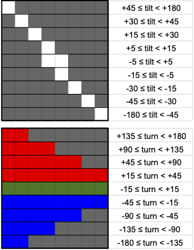

# Project: Motion Feedback

In this project, you will integrate two different modules to implement a visual motion feedback system:
 - the inertial measurement unit (IMU) will continuously measure the acceleration and magnetic field vectors, and
 - the 8-neopixel strip will provide real-time visual feedback to enable the circuit's user to align the IMU's y axis to be level with its y axis pointing north.

The instructions in this project are deliberately less detailed than previous projects, now that you have more experience with building circuits and writing code.

## Build the Circuit

You will need the following components:
 - Pico
 - IMU
 - Neopixel strip
 - I2C cable
 - jumper wires
 - breadboard

We need the breadboard since there is only one 3.3V output available from the Pico, but it must be connected to both the Neopixel strip and the I2C bus.

With your Pico disconnected (i.e. with no power), wire the IMU and neopixel strip to the breadboard, then use jumpers to connect the breadboard signals to the Pico.  You will need to be able to rotate your IMU into different orientations later, so consider this as you select jumper wire lengths.  Also, think about chosing jumper wire colors that allow you to easily identify your power and ground.

Power the Pico via USB and check that the small green LED on the IMU is illuminated.  Open the Mu editor and verify that you can run a simple program to print a message every second.  If the Pico is not responding, this could indicate that you have shorted together power and ground so disconnect the USB cable and check your wiring.

## Read out the Sensors

Write a program to read out the IMU's acceleration and magnetic field vectors and print their component values every 0.5 seconds.  You can adapt our [earlier example](../i2c.md) for this.  Check that both vector magnitudes make sense when the IMU is at rest, i.e.
 - acceleration magnitude is around 9.8 m/s^2 (variations over the surface of the earth are less than 1%)
 - B field magnitude is 25-65 micro Teslas (look up a more precise expected value for your location on [this map that displays nanoTeslas](img/Bfield_strength.jpg))

Notice the diagram of the IMU's right-handed XYZ coordinate system printed on its silkscreen, which defines its local axes.

These sensor readings are fairly noisy so, next implement a loop to average 16 values and observe the improvement.  However, even with averaging the magnetic field measurements will still be noisy since the signal (the earth's magnetic field) is relatively weak.

Try moving the speaker from your kit close to the IMU and observe the effect of the small permanent magnet it contains on your measurements.  If the B field direction is far from where you think north should be, check for any nearby magnets (or large pieces of steel which will distort the magnetic field nearby). In case your laptop is distorting the magnetic field, position your circuit as far away as possible with the USB cable fully extended.

If your sensor values ever stop updating, there may be a problem with the locking of the I2C bus in the CircuitPython libraries: power cycling (by disconnecting and reconnecting USB) should fix this.  If this is happening continuously, there is likely a problem with your code or circuit.

## Calculate Angles

The visual feedback for this project is based on two angles that you can calculate from the acceleration and B field vectors:
 - **tilt**: the angle of the IMU y axis relative to "level", i.e. a plane tangent to the earth's surface.
 - **turn**: the angle of the IMU y axis relative to the component of the magnetic field in the IMU's x-y plane.

The diagram below shows the IMU's x,y,z unit vectors together with the measured (unit) directions of the measured acceleration (left) and magnetic (right) fields, assuming these are due primarily to gravity and the earth's magnetic field. Arrows indicate the rotation axes and sign conventions used to define tilt and turn:


Your calculations of tilt and turn will require trig functions, which are available in the [math library](https://docs.circuitpython.org/en/latest/shared-bindings/math/index.html).  The library trig functions use radians for their input and output values, but you should convert your angles to degrees for display purposes (and there is a `math` function for that).

Your angles should be in the full range of (-180, +180) degrees, but the inverse trig functions `acos`, `asin` and `atan` return results only within a 180-degree range, i.e. using only 2 out of the 4 possible quadrants).  However, there is a useful `atan2` function, documented [here](https://docs.python.org/3/library/math.html#math.atan2), that will return angles in all 4 quadrants.

The sign of your angles should indicate which way to rotate the IMU in order to make its y axis level and pointing towards "north" (the magnetic field measures magnetic north, which is generally different from true north by an [angle that depends on your location](https://en.wikipedia.org/wiki/Magnetic_declination)):
 - tilt > 0 indicates that the +y end of the IMU should be lowered (i.e. rotated counter-clockwise about its x axis) to make it level.
 - turn > 0 indicates that the IMU should be turned west-wards (i.e. rotated counter-clockwise about its z axis)  to make it point north.

Note that, using our definition of tilt, achieving zero tilt does not mean that the IMU x-y plane is horizontal.  Instead we only level the IMU's y axis since this simplifies the trig required and because the tilt of a plane is specified by two angles and so requires more complex visual feedback.

Update your code to calculate and display the tilt and turn values every 0.5 seconds.  Observe how the values change as you rotate the IMU and make sure the range and signs of your angles are correct before moving to the next section.

## Implement Visual Tilt Feedback

Update your program to provide visual feedback on the tilt angle following the top section of the figure below, where dark gray indicates that an LED is off and LEDs are numbered 0-7 from left to right. Use a brightness value of 0.05 to avoid any power consumption issues.  Note that the scheme we are using is intended to simulate the bubble in a traditional [spirit level](https://en.wikipedia.org/wiki/Spirit_level).  Ideally, we would combine the neopixel strip with the IMU in a package that keeps them rigidly connected and aligned, but in this prototype they move independently. However, the feedback you implement will make more sense if you keep them approximately aligned with each other.

Rotate your IMU and verify that only the 9 configurations in the figure are ever displayed and that they correspond to the printed tilt values.  I recommend using `auto_write=False` with `leds.show()` to prevent any intermediate states of the LEDs being displayed momentarily (see [here](https://circuitpython.readthedocs.io/projects/neopixel/en/latest/api.html) for more details.)



## Implement Visual Turn Feedback

Comment out your code for visual tilt feedback and replace it with code for visual feedback on the turn angle, following the bottom section of the guide.

Rotate your IMU and verify that only the 9 configurations in the figure are ever displayed and that they correspond to the printed turn values.

## Implement Simultaneous Tilt and Turn Feedback

Finally, update your visual feedback code to overlay the tilt feedback on top of the turn feedback, i.e. with a white tilt pixel taking precedence over a background red/green/blue turn pixel. Notice how all 81  possible combinations of the individual turn and tilt feedbacks are still distinguishable after being overlayed like this, so we have not sacrificed any information with this scheme.

Rotate your IMU and verify that you now get it level and pointing north using only the visual feedback provided.

Define two boolean variables near the top of your program
```python
TURN_FEEDBACK = True
TILT_FEEDBACK = True
```
and implement your code so that all 4 combinations of `True/False` work correctly.

Finally, remove the print statements and the timing delay from your main loop so your circuit provides more responsive feedback.
