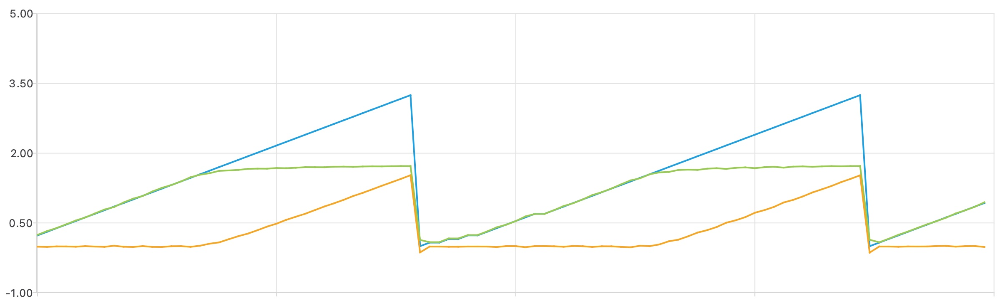

# Project: Waveforms and Photons

In this project, you will generate and monitor analog waveforms to control photons produced by a light-emitting diode (LED). This project assumes you are already familiar with analog [inputs](../inputs.md) and [outputs](../aout.md).

## Analog Waveform Output

Build the circuit shown below with your microcontroller, a pair of 10KΩ resistors, a 1μF capacitor (with the "K" marking), your breadboard and some jumper wires:


The corresponding schematic diagram is:


This is another voltage divider but with a capacitor added. The purpose of the capacitor is to smooth the PWM output from **GP22** by shunting frequencies above 1/RC ~ 100 Hz to ground instead of the ADC input (see [here](https://observablehq.com/embed/@dkirkby/pwm@450?cells=intro%2CpwmPlot%2Cviewof+dutyCycle%2Cviewof+pwmFreq%2Cviewof+filterR%2Cviewof+filterC%2Cfooter) for details).

Use the following program to test this circuit:
```python
import time
import board
import analogio
import pwmio

PWM = pwmio.PWMOut(board.GP22, frequency=1000)
ADC = analogio.AnalogIn(board.A0)

# Set an analog output level using PWM and read an ADC analog input level with averaging.
def measure(outputLevel, numAverage=128, delay=0.001, PWM=PWM, ADC=ADC):
    # Set the output level.
    PWM.duty_cycle = outputLevel
    inputLevel = 0.0
    for sample in range(numAverage):
        time.sleep(delay)
        inputLevel += ADC.value
    return max(round(inputLevel / numAverage), 0)

# Parameters defining the output sawtooth waveform.
LO = 0x0000
HI = 0xffff
STEP = 0x1000

# Set the initial output level.
ADUin = LO
while True:
    # Set the output level and read the corresponding input level.
    ADUout = measure(ADUin)
    # Print the result for the Plotter.
    print('ADUin',ADUin,'ADUout',ADUout)
    # Update the output level.
    ADUin += STEP
    if ADUin > HI:
        ADUin = LO
```
This program defines a utility function called `measure`: you don't need to understand the details of how this works, but I encourage you to read through the code. Values in the code starting with `0x` are integers specified in [hexadecimal notation](https://en.wikipedia.org/wiki/Hexadecimal), which is convenient for the 16-bit unsigned values used to set and read analog levels here.

Download your program and look at the *Shell* window (use **View > Shell** if it is not visible): you should see a stream of numbers being printed, something like this:
```
...
ADUin 57344 ADUout 28556
ADUin 61440 ADUout 30748
ADUin 0 ADUout 1403
ADUin 4096 ADUout 2165
ADUin 8192 ADUout 4262
...
```
Next, open the **Plotter** in the editor using **View > Plotter** to display a real-time graph of these values, which should look something like this:


Does the relationship between the graphs of `ADUin` and `ADUout` make sense in terms of the circuit?

The Plotter is very convenient but not very flexible. See this [video](https://youtu.be/AfR3YzWqu6Q) for more details.  For example, you cannot set the vertical range. You can drag the borders between the editor panels to give the graph more space.  You have now created a crude (and slow) [function generator](https://en.wikipedia.org/wiki/Function_generator) and [oscilloscope](https://en.wikipedia.org/wiki/Oscilloscope) for under $10!

## A Non-linear Circuit

Replace the 10KΩ resistor connected to ground with the green LED, whose datasheet is
[here](../datasheets/LED.pdf). Your LED should now be emitting light during part of the cycle.  If not, try turning it around (the shorter leg of the LED should be connected to ground).

Notice how the displayed `ADUout` waveform has changed with the LED replacing one of the resistors.  The relationship between `ADUin` and `ADUout` is now *non-linear*, i.e. we cannot write a linear equation for Vout in terms of Vin
that is valid throughout the cycle.  This is because diodes are non-linear devices, like transistors (which are basically a pair of diodes) and unlike resistors and capacitors.

There are two distinct phases to each cycle: describe them.  How is the LED emission different in each phase?
The roughly constant voltage across the diode during the second phase is referred to as the *Forward Voltage* in the datasheet, and is also known as the "diode drop".  Refer to Figure 1 in the datasheet to see that the
forward voltage is not actually constant, but depends on the forward current flowing through the LED.

Write an equation for the forward current `iLED` flowing through the LED in terms of the voltages Vin (at pin **GP22**) and Vout (at pin **ADC0**), both in Volts, and the known resistance R in Ohms. You can assume a slowly varying signal for this calculation, which means you can ignore the capacitor so that the LED current equals the current through the 10KΩ resistor.

Modify your code to calculate this current `iLED` in units of 0.1 mA (these strange units are required for plotting voltages and current on the same scale).  You can use the following conversion from ADU to volts (where we are neglecting the small offset you measured in the [DMM Project](DMM.md)):
```python
    Vin = ADUin * 3.3 / 0xffff
    Vout = ADUout * 3.3 / 0xffff
```
Note the use of hexadecimal again: `0xffff` equals the maximum possible (unsigned) 16-bit value of $$2^{16} - 1 = 65,535$$.

Modify your code to plot `Vin`, `Vout` and `iLED` using:
```python
    print('Vin',Vin,'Vout',Vout,'iLED',iLED)
```
You should see something like this:



The curves of `Vin` and `Vout` are similar to the earlier curves for `ADUin` and `ADUout` but rescaled from ADU to Volts.  If you get a different `iLED` curve, check your calculation of the current and that you have converted to 0.1 mA units.

## A Pulsing LED

Our next goal is to control photon emission from the LED, but this only occurs during the second phase of the cycle.
To restrict our cycle to the second phase, we need to find a suitable value of the `LO` variable corresponding to when the LED current first starts its linear increase.  Modify your code to print values of `ADUin` (in hexadecimal) and `iLED` using:
```python
    print('ADUin',hex(ADUin),'iLED',iLED)
```
To print just one cycle, add a `break` statement:
```python
    if ADUin > HI:
        break
        ADUin = LO
```
To get finer steps, reduce the step size:
```python
STEP = 0x0400
```
The *Plotter* is not useful here (because `ADUin` and `iLED` have very different scales) so use the *Shell* window to inspect the numerical values. Look through the printed table of `ADUin` and `iLED` values to find a suitable value of `LO` where `iLED` first starts its linear increase. Since there is some noise in these values, a practical guide is to estimate the value of `LO` where `iLED` crosses the threshold of 0.025 (in units of 0.1mA).

Change the value of `LO` in your code to the value you found (replacing the original `0x0000`), and remove the `break` (to restore repeating cycles). Leave the stepsize at `0x0400`. Now your circuit should only cycle through `ADUin` values where the LED is illuminated, gradually ramping up in brightness.

Finally, modify your loop to modulate the LED brightness with a smooth sine function with a period of 5 seconds.  To accomplish this, you will need to replace the sawtooth ramp of `ADUin` with a sinusoidal variation of `ADUin` between the limits of `LO` and `HI`, i.e.
$$
y(t) = y_0 + \Delta y \sin(2\pi t / T)
$$
with $y_0 - \Delta_y$ equal to `LO`, $y_0 + \Delta_y` equal to `HI`, and $T = 5$ seconds.

In order to access the current time in your "run forever" loop, you can use `time.monotonic()`, which returns a *floating-point* value (i.e. something with a decimal point) in seconds, not an integer. You will also need to use python's [sine function](https://docs.python.org/3/library/math.html#math.sin) and definition of $\pi$. In order to use any python math functions or constants, you will need to `import math` before your `while True:`. Here is the complete program, with the parts you need to fill in indicated with `???`:
```python
import time
import board
import analogio
import pwmio
import math

PWM = pwmio.PWMOut(board.GP22, frequency=1000)
ADC = analogio.AnalogIn(board.A0)

# Parameters defining the ADU range of linear LED response
LO = ???
HI = 0xffff
# Period of the oscillation
T = 5.0

while True:
    t = time.monotonic()
    y = ???
    PWM.duty_cycle = int(y)
    time.sleep(0.05)
```
Note the use of `int(y)` to convert the floating point value of `y` to its closest integer, since a PWM `duty_cycle` must be an integer value.

## Photon Control

Your design is now directly controlling the forward current flowing through the LED.  Next, you will estimate the corresponding rate of photons entering your eye...

Modify your code so that a constant forward current of 0.1mA flows through the LED.  Go back to the printed table of `ADUin` and `iLED` values to determine an ADU value `ON` that corresponds approximately to 0.1mA (remembering that `iLED` is in units of 0.1mA!) Decreasing the value of `STEP` will make it easier to find an `ADUin` value that prints `iLED` close to 1.0.

In your program's main loop, toggle a 0.1mA LED current on and off, once per second, using (replace `???` with your `ON` value):
```python
import time
import board
import analogio
import pwmio

PWM = pwmio.PWMOut(board.GP22, frequency=1000)
ADC = analogio.AnalogIn(board.A0)

# Set an analog output level using PWM and read an ADC analog input level with averaging.
def measure(outputLevel, numAverage=128, delay=0.001, PWM=PWM, ADC=ADC):
    # Set the output level.
    PWM.duty_cycle = outputLevel
    inputLevel = 0.0
    for sample in range(numAverage):
        time.sleep(delay)
        inputLevel += ADC.value
    return max(round(inputLevel / numAverage), 0)

# ADU values that give an LED current of 0.1mA (ON) or 0.0mA (OFF)
ON = ???
OFF = 0x0000

while True:
    ADUout = measure(ON)
    time.sleep(0.5)
    ADUout = measure(OFF)
    time.sleep(0.5)
```
Check that this indeed blinks the LED once per second.

Calculate the number of electrons passing through the LED per second at 0.1mA. Each electron has some probability to be converted into a photon leaving the LED known as the **quantum efficiency**.  The datasheet does not provide this value, so we will assume it is 1%.

Next, assume that your pupil is a circle of 5mm diameter, and calculate the fraction of photons entering your eye from an LED 1 meter away that emits *isotropically*, i.e. with equal intensity in all directions. How would this fraction change if the distance was increase by a factor of two?

Observe the LED from directly overhead (the "north pole") then at a 90 degree angle (the "equator") and notice that the actual LED emission is far from isotropic. The LED's clear plastic body, viewed from above, is not round but elliptical, as shown on page 9 of the datasheet.  Is the brightness along the equator different when you look at the short or axis of this ellipse?

Figure 6 of the datasheet shows the LED's **field pattern** of relative luminous intensity (brightness) for different viewing angles.  An accurate calculation of the photon rate into your eye would need to model and  account for these field-angle effects.  Instead, we will simply assume that a viewing angle of 80 degrees, close to the equator and looking toward the long axis of the ellipse, results in a factor of 10 reduction in the photon rate relative to an isotropic emitter.

Figure 5 of the datasheet shows that the green LED photons are emitted within a narrow range of wavelengths centered around 530 nanometers (nm).

Combine the factors above to estimate the rate of 530 nm photons entering your eye, per second, at an 80 degree viewing angle, as a function of distance from the LED in meters.  Assume that the LED is always on for the purposes of this calculation, i.e. you do not need to account for the on/off toggle.

Find a dark location and determine the distance at which you can just barely detect the blinking LED with your eye.  What is your corresponding detection threshold rate in photons per second?  Note that the human eye can detect single photons under [special conditions](https://en.wikipedia.org/wiki/Absolute_threshold#Vision) but your experiment will likely be limited by the ambient light levels.

Write the threshold distance (in meters) that you found and your corresponding threshold rate (in photons/sec) in a comment at the bottom of the code that you submit for this project.
