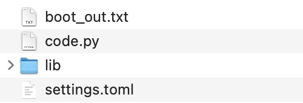
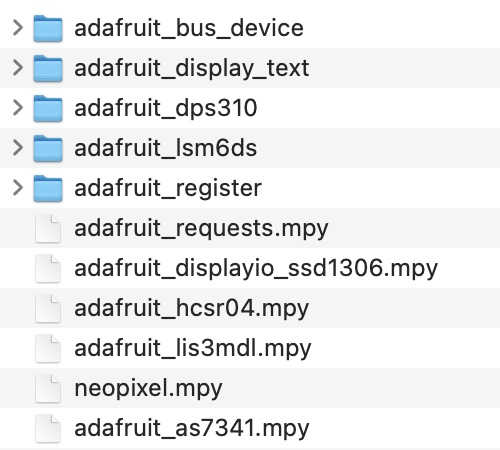

# Initial Microcontroller Setup

*Material for a [UC Irvine](https://uci.edu/) course offered by the [Department of Physics Astronomy](https://www.physics.uci.edu/) and developed by [David Kirkby](https://faculty.sites.uci.edu/dkirkby/).*

Each kit includes two Raspberry Pi Pico-W microcontroller boards. You will use these to bring your circuits to life with
some python programs that you write.  A microcontroller is a simple device that runs a single relatively simple program. It is not what you normally think of as a "computer", with an operating system or file system, unlike its bigger sister the [Raspberry Pi 4](https://www.raspberrypi.com/products/raspberry-pi-4-model-b/).

Each microcontroller contains two "firmware" programs: a bootloader (similar to a computer's BIOS program) and a main program (similar to computer's operating system kernel).  The traditional way of working with a microcontroller is to install a new main program (often written in C) every time you make a change to your code, using the bootloader.  However, these devices are now capable enough to run a python interpreter, which enables simpler programming and allows you to focus more on design and less on low-level details. Therefore, the steps below install [CircuitPython](https://circuitpython.org/) as the main program.

The final piece of software you will need is an editor that works well with the CircuitPython development environment.  Unlike the bootloader and main program, which run on the microcontroller, the editor runs on your computer and communicates with the microcontroller over USB.

The steps described below ensure that you have current working versions of these programs, and are based on the general instructions [here](https://circuitpython.org/board/raspberry_pi_pico_w/). These instructions were last updated in Jan 2025. For archived past instructions see [Jan 2024](2023/setup2024.md), [Jan 2023](2023/setup2023.md), [Jan 2022](2022/setup2022.md) or [Jan 2021](2021/setup2021.md).

## Install CircuitPython on each Pico W

Download this [circuit python program](bin/adafruit-circuitpython-raspberry_pi_pico_w-en_US-9.2.1.uf2?raw=true) to your laptop.  Since this program will run on the microcontroller, not your laptop, it does not matter what operating system your laptop is running.

Connect the Pico W to your laptop with a USB cable and look for a new USB drive in your operating system. If no USB drive appears, let the instructor know, and try using your other Pico W.

### Reset your USB drive if it is not called RPI-RP2

If your USB drive is called **RPI-RP2**, skip to the section below. Otherwise, it is mostly likely called **CIRCUITPY** and this just means someone else has already installed an older version of the software you will need for this course. To reset your Pico W and continue with the instructions below, follow these steps:
 - Open the drive and delete all of the files it contains. You will also need to empty the Trash on a Mac.
 - Unmount the **CIRCUITPY** drive and uplug the USB from your laptop.
 - Press down the small white button while you plug the USB back into your laptop.
 - You should now see the drive called **RPI-RP2** and can release the white button and proceed with the steps below.

### Install software on USB drive called RPI-RP2

Copy the downloaded file to the USB drive, e.g. using drag and drop.  After a short while (10-20 secs) the **RPI-RP2** drive should be replaced with one called **CIRCUITPY**.  This indicates that you have successfully installed the CircuitPython program on your microcontroller.

> Mac users will probably get a warning about "Disk Not Ejected Properly" that you can safely ignore.

If you open your **CIRCUITPY** drive, you should see only a single small text file `boot_out.txt` that starts with the lines:
```
Adafruit CircuitPython 9.2.1 on 2024-11-20; Raspberry Pi Pico W with rp2040
Board ID:raspberry_pi_pico_w
```
If you see other files, and you forgot to delete them in the instructions above, delete them now and repeat this section. Otherwise, let the instructor know.

Unmount your **CIRCUITPY** drive the same way you would remove any USB drive, then repeat these steps for the other Pico W in your kit.

> Since both of your microcontrollers now have the same USB drive name, it would be confusing to have them both connected to your laptop at the same time.  However, while we will sometimes use both at once in a project, we will not need them both connected via USB at once.

## Libraries

Some of the components in the kit need additional libraries that are not installed when you install CircuitPython. Any extra libraries needed are always mentioned in the comments at the top of each component's [hello example](hello.md).

To install an additional library, you just copy it into a `lib` folder of your **CIRCUITPY** USB drive. You only need to do this once.  The instructions below show you how to install all of the libraries for the kit components at once.

Since we are running CircuitPython 9.2.1, we need to install libraries from the 9.x bundle (we are using 9.x from the [20250106 auto release](https://github.com/adafruit/Adafruit_CircuitPython_Bundle/releases/tag/20250106)). We do not install the whole bundle since it is too big to fit in the microcontroller memory.

Download and expand [this zip file](bin/E4S-libraries-9.x.zip?raw=true) with the libraries needed by the following kit components:
 - OLED display
 - pressure & altitude sensor
 - acceleration & rotation & magnetic field sensor
 - 10-band photodetector
 - ultrasonic distance sensor
 - Pico-W wifi networking

The expanded folder should be called `lib`. Open your **CIRCUITPY** USB drive and copy the `lib` folder (e.g. using drag and drop) to your **CIRCUITPY** USB drive.

> In case you do this later on, note that copying to **CIRCUITPY** will always restart any program that is already running on the board.

Your **CIRCUITPY** drive should now have the following contents:



and the `lib` folder should contain:



You are now ready to use these libraries.

## Install the Mu Editor

You have completed the setup of your microcontroller boards and are now ready to install a code editor on your laptop.

Any file named `code.py` on your **CIRCUITPY** drive will be automatically run whenever your microcontroller is reset, either when you initially connect it via USB or when you press its reset button.

In principle, you can use any text or code editor to modify `code.py` directly from the USB drive.  However,
we will start with the [Mu Editor](https://codewith.mu/) which is specifically designed to work well with Adafruit microcontroller boards and CircuitPython.

Visit this [download page](https://codewith.mu/en/download) to select the appropriate official installer for your computer.

The first time you run the Mu Editor, you will be prompted to select a [mode](https://codewith.mu/en/tutorials/1.0/modes): select the *Adafruit CircuitPython* mode (or, *CircuitPython* if that is not available).  Whenever you are running Mu, you can view and change your mode by clicking on the *Mode*  button in the toolbar.

The name of the file you are currrently editing appears in the editor title bar, and should generally be `code.py`.  The first time you use the Mu Editor with a new **CIRCUITPY** drive installed, the name will be `untitled` and you will be prompted for a name: use `code.py`.

I recommend that everyone start with the Mu Editor.  However, if you prefer to use a different editor, start [here](https://learn.adafruit.com/welcome-to-circuitpython/creating-and-editing-code#1-use-an-editor-that-writes-out-the-file-completely-when-you-save-it-2977444-22).

You are now ready to [start programming your microcontroller boards](first-prog.md).
